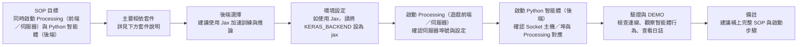

# ML_Game - 機器學習遊戲 AI 專題

> 使用強化學習 (Reinforcement Learning) 開發多款遊戲 AI 系統，涵蓋 DQN 等主流程解法

## 🚀 專案簡介

本專題致力於使用強化學習技術開發遊戲 AI 系統，目前包含兩個代表性案例：

1.  **🏓 乒乓球遊戲 AI 系統 (Ping Pong Game AI)**：利用 Deep Q-Network (DQN) 訓練 AI 代理，使其學會高效的乒乓球遊戲策略。
2.  **🎮 TetrAI - 俄羅斯方塊對戰 AI**：強化學習 AI 智能體可自動學習 Tetris 遊戲策略，支援進階行為（B2B、T-Spin、Ghost Piece 等）。

---

## 📚 目錄

- [🚀 專案簡介](#-專案簡介)
- [1. 🏓 乒乓球遊戲 AI 系統](#1--乒乓球遊戲-ai-系統)
- [2. 🎮 TetrAI - 俄羅斯方塊對戰 AI](#2--tetrai---俄羅斯方塊對戰-ai)
- [🕹️ Tetris AI 專案完整執行 SOP](#-tetris-ai-專案完整執行-sop)
- [📄 授權](#-授權)
- [📝 簡報 Todo](#-簡報-todo)
- [👥 分工表](#-分工表)

---

## 1. 🏓 乒乓球遊戲 AI 系統

本專案的核心是使用 **Deep Q-Network (DQN)** 強化學習演算法，訓練一個 AI 代理來學習並掌握乒乓球遊戲的策略。

### 核心技術
- **深度強化學習 (DRL)**：結合深度學習與強化學習，處理高維度狀態空間。
- **Bellman 方程應用**：用於計算最優動作價值函數。
- **經驗回放 (Experience Replay)**：打破數據相關性，提高訓練穩定性。
- **目標網絡 (Target Network)**：穩定 Q 值更新，防止訓練發散。

| 指標 | 目標值 |
| :--- | :--- |
| 接球成功率 | ≥85% |
| 推理延遲 | <30 ms |
| 訓練收斂 | ≤2 小時 |


- DEMO:

https://github.com/user-attachments/assets/162027fa-aeb2-4d6c-8088-23f69ab33ba1

🔗 [**線上瀏覽 - 乒乓球 AI 專題報告**](https://github.com/C111112104/ML_Game/blob/main/doc/ping-pong-ai-project.md)

---

## 2. 🎮 TetrAI - 俄羅斯方塊對戰 AI

- 強化學習 AI 智能體可自動學習 Tetris 遊戲策略。
- 嚴謹 Socket 架構（Processing 遊戲引擎 ＋ Python 智能體）。
- **核心特性**：多代理訓練、DQN 與遺傳演算法混合策略、高維度特徵工程。

- DEMO:

https://github.com/user-attachments/assets/882650b6-983f-4413-ace2-96f905f11f89

🔗 [**TetrAI 專題詳細提案**](https://github.com/C111112104/ML_Game/blob/main/doc/TetrAI_Proposal.md)

---

## 🕹️ Tetris AI 專案完整執行 SOP



### 🎯 必備工具與環境設定
| 項目 | 說明 | 取得方式 |
| :--- | :--- | :--- |
| Processing IDE | 用於執行遊戲介面和網路伺服器 | 官方網站下載 |
| Python 3 | 用於執行 AI 訓練和決策 | 官方網站下載 |

### 🛠️ 步驟一：環境依賴安裝
1. **Processing**: 安裝 `Minim` 函式庫。
2. **Python**: `pip install keras numpy pillow tqdm tensorboard opencv-python jax`

---

## 📄 授權
本專案採用 [MIT License](LICENSE) 授權。

---

## 📝 簡報 Todo

| 日期 | 項目 |
| :-- | :-- |
| 1211 | 關於 `ping-pong-ai-project.md`：1) Dueling 的目標 Q 值在 `Ben_DQN.py` 中目標 Q 值是多少？ 2) Dueling Q 值計算公式中的 A 值代表 reward 嗎？在 `Ben_DQN.py` 中每次給的 reward 是多少？ |
| 1218 | (空 / 待補) |

1. Tertx 補 breakdown diargam , API table
2. breakdown diargam , API table 需要對應
3. 對各個 breakdown 的 submodule 單元測試 結果，貼到簡報
4. 找 loss function 曲線結果圖

---

## 👥 分工表

| 組員 | 工作量 |
| :--- | :--- |
| 博皓 | 33% |
| 亞倫 | 33% |
| 東穎 | 33% |

---

## 📂 檔案結構

```text
.
├── TetrAI-code/
│   ├── ChooseDifficultyPage.pde
│   ├── README.md
│   ├── aboutPage.pde
│   ├── animation.pde
│   ├── button.pde
│   ├── config.pde
│   ├── gameOverPage.pde
│   ├── gamePage.pde
│   ├── helpPage.pde
│   ├── main.pde
│   ├── mapManage.pde
│   ├── moveHandler.pde
│   ├── page.pde
│   ├── pieceManager.pde
│   ├── players.pde
│   ├── server.py
│   ├── serverHandler.pde
│   ├── startPage.pde
│   └── tetris.pde
├── doc/
│   ├── material/
│   ├── TetrAI_Proposal.md
│   └── ping-pong-ai-project.md
├── saved_models/
│   ├── dqn_episode_*.pth
│   └── replay_buffer_*.pkl
├── tetrAI/
├── BEN_DQN.py
├── Ben.py
├── README.md
├── ann_train.py
├── sync_git.sh
└── training_log.csv
```