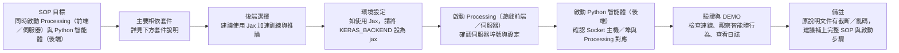

# ML_Game - 機器學習遊戲 AI 專題

> 使用強化學習 (Reinforcement Learning) 開發多款遊戲 AI 系統，涵蓋 DQN 等主流程解法

## 📚 專題內容

本專題包含兩個代表性案例：

### 1. 🏓 乒乓球遊戲 AI（Ping Pong Game）

- 利用 Deep Q-Network (DQN) 強化學習訓練遊戲 AI
- 實作細節與理論請參考：[乒乓球 AI 專題簡報](https://github.com/C111112104/ML_Game/blob/main/doc/ping-pong-ai-project.md)

- DEMO
 

https://github.com/user-attachments/assets/162027fa-aeb2-4d6c-8088-23f69ab33ba1

---

### 2. 🎮 TetrAI - 俄羅斯方塊 AI 對戰系統

- 強化學習 AI 智能體可自動學習 Tetris 遊戲策略
- 支援進階行為（B2B、T-Spin、Ghost Piece 等）
- 詳細解構與流程圖，請見：[TetrAI 專題詳細提案](https://github.com/C111112104/ML_Game/blob/main/doc/TetrAI_Proposal.md)

- DEMO:
- https://github.com/user-attachments/assets/882650b6-983f-4413-ace2-96f905f11f89
- 
---

## Tetris AI 專案 SOP

---

## 簡報 Todo

| 日期 | 項目 |
| :-- | :-- |
| 1211 | 關於 `ping-pong-ai-project.md`：1) Dueling 的目標 Q 值在 `Ben_DQN.py` 中目標 Q 值是多少？ 2) Dueling Q 值計算公式中的 A 值代表 reward 嗎？在 `Ben_DQN.py` 中每次給的 reward 是多少？ |
| 1218 | (空 / 待補) |

---
