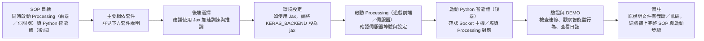

# ML_Game - 機器學習遊戲 AI 專題

> 使用強化學習 (Reinforcement Learning) 開發多款遊戲 AI 系統，涵蓋 DQN 等主流程解法

## 📚 專題內容

本專題包含兩個代表性案例：

### 1. 🏓 乒乓球遊戲 AI（Ping Pong Game）

- 利用 Deep Q-Network (DQN) 強化學習訓練遊戲 AI
- 實作細節與理論請參考：[乒乓球 AI 專題簡報](https://github.com/C111112104/ML_Game/blob/main/doc/ping-pong-ai-project.md)

**特色重點：**

- 深度強化學習智能體設計
- Bellman 方程、自動回放、目標網路等核心技術
- 經完整測試與實證

| 指標 | 目標值 |
| :-- | :-- |
| 接球成功率 | ≥85% |
| 推理延遲 | <30 ms |
| 訓練收斂 | ≤2 小時 |

---

### 2. 🎮 TetrAI - 俄羅斯方塊 AI 對戰系統

- 強化學習 AI 智能體可自動學習 Tetris 遊戲策略
- 支援進階行為（B2B、T-Spin、Ghost Piece 等）
- 嚴謹 Socket 架構（Processing 遊戲引擎＋Python 智能體）
- 詳細解構與流程圖，請見：[TetrAI 專題詳細提案](https://github.com/C111112104/ML_Game/blob/main/doc/TetrAI_Proposal.md)

- DEMO:
- https://github.com/user-attachments/assets/882650b6-983f-4413-ace2-96f905f11f89

**核心特性：**

- 多代理訓練（未來將支援 PvP 對戰）
- DQN 與遺傳演算法混合策略
- 高維度特徵工程與資料驅動學習
- 完整模組分解、架構流程、系統分析
- 所有關鍵架構圖直接用 Markdown 標記語法書寫

---

## Tetris AI 專案 SOP（摘要與流程圖）

（為避免 Mermaid 解析錯誤，含方括號的安裝說明放在圖外）

主要相依套件與安裝說明（放在圖外以避免 mermaid 語法衝突）：

- pip 安裝常用套件（範例）：
  - pip install keras numpy pillow tqdm tensorboard opencv-python
- Jax（建議作為後端）：
  - 若有 NVIDIA GPU（CUDA 12 範例）：pip install jax[cuda12]
  - 若無 GPU：pip install jax
- 若使用 Jax，執行前請設定環境變數，例如在 macOS / Linux 終端機：
  - export KERAS_BACKEND="jax"

由於 TetrAI 程式碼過大（523.3 MB），改暫存於 Google 雲端硬碟：  
[https://drive.google.com/file/d/1_CELBGUG1l-ZR28EAitfSU56Nez66iVP/view
](https://drive.google.com/drive/folders/1S_KZzMgcLDl7pfgDp02hOmo5vlgN5j6J?usp=sharing)
建議在本專案中補充或確認下列項目以完成 SOP：
- Processing 的啟動指令與範例（含埠號與啟動參數）
- Python 智能體的啟動腳本（範例指令）與必要環境變數
- Socket 連線格式（IP、Port、訊息協定簡述）
- 如何在本機驗證（例如測試模式、錄影或 log 檔位置）
- 若使用 Jax，說明 CUDA／驅動相容性與安裝建議

---

## 簡報 Todo

| 日期 | 項目 |
| :-- | :-- |
| 1211 | 關於 `ping-pong-ai-project.md`：1) Dueling 的目標 Q 值在 `Ben_DQN.py` 中目標 Q 值是多少？ 2) Dueling Q 值計算公式中的 A 值代表 reward 嗎？在 `Ben_DQN.py` 中每次給的 reward 是多少？ |
| 1218 | (空 / 待補) |

---
