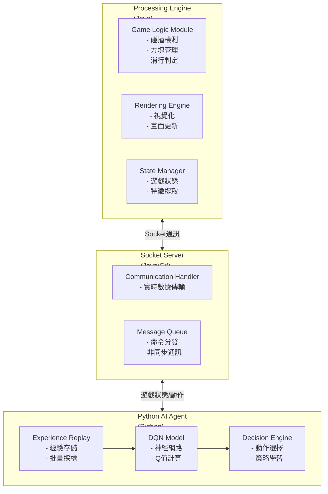
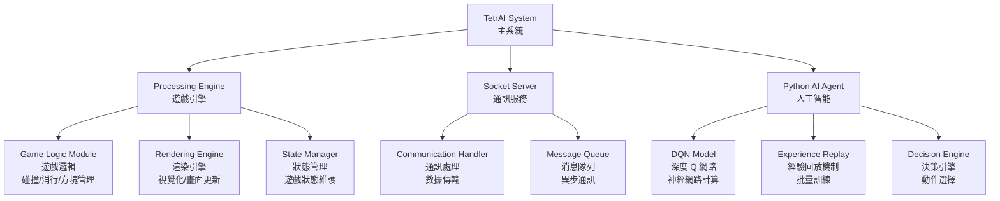
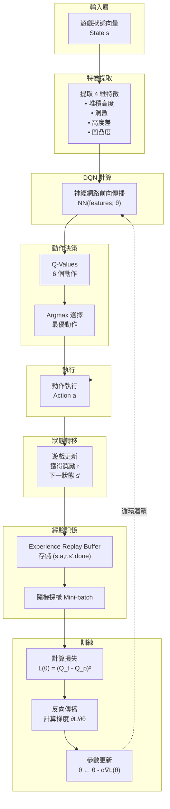

# 機器學習專題：TetrAI (深度強化學習玩俄羅斯方塊)

## 📋 目錄
- [一、需求分析](#一需求分析)
- [二、系統分析](#二系統分析)
- [三、系統設計](#三系統設計)
- [四、編碼實現](#四編碼實現)
- [五、驗證測試](#五驗證測試)

---

## 一、需求分析

### 1.1 功能需求

| 功能項目 | 說明 | 優先級 |
|---------|------|--------|
| **遊戲引擎** | 實現俄羅斯方塊的基本遊戲邏輯（方塊生成、下落、碰撞、消行） | P0 |
| **AI 訓練** | 使用 DQN 演算法訓練 AI 自動玩遊戲 | P0 |
| **通訊協議** | Processing 與 Python 透過 Socket 實時通訊 | P0 |
| **狀態管理** | 實時提取遊戲狀態特徵（行數、洞數、高度差、凹凸度） | P0 |
| **決策引擎** | AI 根據狀態輸出最優動作（移動、旋轉、加速） | P0 |
| **視覺化** | 遊戲畫面渲染與 AI 決策過程可視化 | P1 |
| **性能監控** | 記錄訓練曲線、消行數、遊戲時長 | P1 |

### 1.2 規格需求

| 規格項目 | 需求 | 說明 |
|---------|------|--------|
| **平台支援** | Windows & Linux | 跨平台相容性 |
| **遊戲解析度** | 320×240 或更高 | 清晰度要求 |
| **網絡通訊** | Socket TCP/IP | 實時低延遲通訊 |
| **模型框架** | TensorFlow / PyTorch | 深度學習框架 |
| **輸入狀態** | 4 維特徵向量 | 遊戲狀態表示 |
| **輸出動作** | 6 種離散動作 | 左移、右移、旋轉、下落、加速、靜止 |
| **學習率** | 0.001 - 0.01 | 神經網路超參數 |

### 1.3 效能需求

| 效能指標 | 目標值 | 說明 |
|---------|--------|------|
| **訓練收斂速度** | 500-1000 episodes | 達到可玩水準 |
| **遊戲 FPS** | 60 FPS | 流暢渲染 |
| **AI 決策延遲** | < 50 ms | 實時響應 |
| **平均消除行數** | 100+ 行/局 | 遊戲能力衡量 |
| **最高紀錄** | 1000+ 行 | 卓越表現 |
| **訓練時間** | 2-4 小時 | GPU 環境下 |
| **模型大小** | < 5 MB | 輕量化部署 |

### 1.4 驗收方法

| 驗收項目 | 驗收標準 | 測試方法 |
|---------|---------|---------|
| **功能完整性** | 所有 P0 功能實現 | 功能清單檢查 |
| **跨平台運行** | Windows & Linux 無故障 | 平台部署測試 |
| **通訊穩定性** | 24 小時連續運行無斷連 | 長時間運行測試 |
| **AI 智能性** | 自動玩遊戲 > 100 行/局 | 性能測試 |
| **實時性** | 決策延遲 < 50ms | 延遲測量 |
| **代碼質量** | 文檔完整、註解清晰、架構模塊化 | 代碼審查 |
| **可視化效果** | UI/UX 清晰易用 | 用戶測試 |

---

## 二、系統分析

### 2.1 系統架構概述



### 2.2 DQN 演算法核心

#### 2.2.1 Q-Learning 基礎

**Q 函數定義：**
```
Q(s, a) = 當前狀態 s 下執行動作 a 的期望未來獎勵
```

**Bellman 方程式：**
```
Q(s, a) = E[r + γ × max Q(s', a')]
```
- `r`: 即時獎勵
- `γ`: 折扣因子 (0.99)
- `s'`: 下一狀態
- `a'`: 下一狀態的最優動作

#### 2.2.2 神經網路近似

使用深度神經網路來近似 Q 函數，而非查表：
```
Q(s, a) ≈ NN(s; θ)
```

### 2.3 損失函數詳解：L(θ)

#### 表格：θ 在 L(θ) 中的含義與機制

| 符號 | 數學表示 | 遊戲中的含義 | 機制說明 |
|------|--------|-----------|---------|
| **θ** | Network Parameters | 神經網路的所有權重與偏置 | DQN 模型的可學習參數，透過反向傳播不斷調整 |
| **L(θ)** | Loss Function | 損失函數 = MSE | 量化預測 Q 值與目標 Q 值的偏差程度 |
| **Q_predicted(s,a;θ)** | 預測 Q 值 | AI 根據當前狀態預估的行動價值 | 由神經網路用 θ 參數計算，表示該動作的期望回報 |
| **Q_target(s,a)** | 目標 Q 值 | 使用 Bellman 方程計算的真實目標值 | 目標網路計算：r + γ×max Q(s', a'; θ_old) |
| **∂L/∂θ** | 梯度 | 損失對參數的偏導 | 指示每個參數應調整的方向與幅度 |
| **θ ← θ - α×∂L/∂θ** | 參數更新 | 梯度下降優化步驟 | 每次訓練迭代，θ 沿著負梯度方向移動，減小 L(θ) |

#### 表格：L(θ) 公式詳解

| 公式部分 | 表達式 | 含義 |
|---------|--------|------|
| **損失函數** | `L(θ) = 1/N Σᵢ(Q_target - Q_predicted)²` | 平方誤差損失 |
| **目標值計算** | `Q_target = r + γ × max Q(s', a'; θ⁻)` | Bellman 目標，θ⁻ 為舊網路參數 |
| **預測值計算** | `Q_predicted = NN(s, a; θ)` | 主網路用當前 θ 計算 |
| **最小化損失** | `min_θ L(θ)` | 找到最優 θ 使損失最小 |
| **梯度下降** | `θ_new = θ_old - α × ∇_θ L(θ)` | 反向傳播更新參數，α 為學習率 |

#### 表格：遊戲中的 θ 更新案例

| 訓練階段 | θ 的狀態 | L(θ) 變化 | 遊戲表現 | 說明 |
|---------|---------|----------|---------|------|
| **初始化** | 隨機初始化 | 極大（L ≈ 100+） | 隨意亂動 | θ 尚未學習任何策略 |
| **早期訓練** | 快速調整 | 快速下降 | 開始學習基本操作 | 神經網路逐步識別狀態-動作模式 |
| **中期訓練** | 逐步精細化 | 平穩下降 | 能清除少量行 | θ 編碼了可行策略 |
| **後期訓練** | 逐步穩定 | 低值穩定（L ≈ 0.1-1） | 穩定消除 100+ 行 | θ 已收斂到近似最優策略 |
| **收斂完成** | 基本不變 | 波動很小 | 卓越表現（1000+ 行） | 模型已充分學習最優 Q 函數 |

**θ 的實際機制：**
1. **初始化階段**：θ 被隨機初始化為小數值
2. **前向傳播**：狀態 s 通過 NN(s; θ) 得到 Q 值預測
3. **損失計算**：計算 L(θ) = (Q_target - Q_predicted)²
4. **反向傳播**：計算梯度 ∂L/∂θ
5. **參數更新**：θ ← θ - α × ∂L/∂θ（沿梯度反方向移動）
6. **循環迭代**：重複直至 L(θ) 收斂

### 2.4 系統數據流

```mermaid
graph LR
    GameState["遊戲狀態<br/>Game State"]
    FeatureExtract["特徵提取<br/>Feature Extract<br/>行數/洞/高度差/凹凸度"]
    DQNNetwork["DQN 神經網路<br/>NN(s; θ)<br/>計算 Q 值"]
    QValues["Q 值<br/>6 個動作的<br/>期望回報"]
    ActionSelect["動作選擇<br/>argmax(Q)<br/>選最優動作"]
    Action["執行動作<br/>Action"]
    Executor["遊戲引擎執行<br/>Game Engine"]
    Transition["狀態轉移<br/>r, s', done"]
    ExpBuffer["經驗緩衝<br/>Experience Buffer<br/>存儲 s,a,r,s'"]
    MiniBatch["小批次採樣<br/>Mini-batch"]
    Training["訓練計算<br/>L(θ)"]
    Backprop["反向傳播<br/>∂L/∂θ"]
    Update["參數更新<br/>θ←θ-α∇L"]
    
    GameState --> FeatureExtract
    FeatureExtract --> DQNNetwork
    DQNNetwork --> QValues
    QValues --> ActionSelect
    ActionSelect --> Action
    Action --> Executor
    Executor --> Transition
    Transition --> ExpBuffer
    ExpBuffer --> MiniBatch
    MiniBatch --> Training
    Training --> Backprop
    Backprop --> Update
    Update -.循環迭代.-> DQNNetwork
```



---

## 三、系統設計

### 3.1 系統模組分支結構



### 3.2 WBS 結構圖


**WBS 層級說明：**

**Level 1: 主系統**
- TetrAI System：整個項目頂層

**Level 2: 三大主模組**
- Processing Engine：遊戲引擎
- Socket Server：通訊服務
- Python AI Agent：人工智能

**Level 3: 子模組**
- **Processing Engine**
  - Game Logic Module：遊戲邏輯（碰撞檢測、方塊管理、消行）
  - Rendering Engine：渲染引擎（視覺化）
  - State Manager：狀態管理（遊戲狀態維護）

- **Socket Server**
  - Communication Handler：通訊處理
  - Message Queue：消息隊列（異步通訊）

- **Python AI Agent**
  - DQN Model：深度 Q 網路
  - Experience Replay：經驗回放機制
  - Decision Engine：決策引擎

### 3.3 Message Sequence Chart (MSC) - 系統流程

```mermaid
sequenceDiagram
    participant Processing as Processing Engine
    participant Socket as Socket Server
    participant Python as Python AI Agent

    Processing->>Socket: ① 遊戲狀態
    Socket->>Python: ② 特徵提取 (state features)
    Python->>Socket: ③ 前向傳播 NN(s;θ)，回傳 Q-Values
    Socket->>Python: ④ Argmax選擇最優動作
    Socket->>Processing: ⑤ 執行動作
    Processing->>Socket: ⑥ 遊戲更新/狀態轉移
    Socket->>Python: ⑦ 獎勵 r 和下一狀態 s'
    Python->>Python: ⑧ 存儲 (s,a,r,s') 到經驗回放
    Python->>Python: ⑨ 計算損失 L(θ)、反向傳播、參數更新
    Note over Processing,Python: 重複上述步驟迴圈進行訓練

```

### 3.4 Data Flow Diagram (DFD)



### 3.5 技術棧設計

| 層級 | 技術 | 選型理由 |
|------|------|--------|
| **遊戲引擎** | Processing 3 (Java) | 跨平台、強大的 2D 圖形庫 |
| **通訊中間件** | Socket (TCP/IP) | 低延遲、實時通訊 |
| **深度學習框架** | TensorFlow / PyTorch | 生態完整、性能穩定 |
| **程式語言** | Python | 機器學習生態豐富 |
| **數值計算** | NumPy | 高效向量化運算 |
| **部署環境** | GPU (CUDA) | 加速訓練 |
| **監控工具** | Tensorboard | 訓練可視化 |

---

## 四、編碼實現

*（此章節將在後續迭代中補充）*

---

## 五、驗證測試

### 5.1 單元測試計畫

| 測試模組 | 測試項目 | 預期結果 | 驗收標準 |
|---------|---------|---------|---------|
| **Game Logic** | 方塊碰撞檢測 | 正確識別碰撞 | 100% 邊界情況覆蓋 |
| **Game Logic** | 消行判定 | 滿行自動消除 | 消行正確率 100% |
| **State Manager** | 狀態提取精度 | 特徵準確計算 | 與預期值誤差 < 0.1% |
| **Socket Server** | 連接穩定性 | 24h 無斷連 | 連接成功率 > 99.9% |
| **Socket Server** | 訊息延遲 | 延遲 < 50ms | P95 延遲 < 100ms |
| **DQN Model** | 前向傳播 | 輸出 6 個 Q 值 | 形狀正確、無 NaN |
| **DQN Model** | 梯度計算 | 梯度無爆炸/消失 | 梯度在合理範圍 |
| **Experience Replay** | 采樣正確性 | 隨機採樣無偏 | 分佈均勻性檢驗 P>0.05 |

### 5.2 集成測試計畫

| 測試場景 | 測試步驟 | 預期結果 | 驗收條件 |
|---------|---------|---------|---------|
| **E2E 流程** | 遊戲狀態 → AI 決策 → 動作執行 | 閉環完整 | 延遲 < 200ms |
| **訓練流程** | 100 episodes 訓練 | 損失函數單調遞減 | Loss ↓ > 80% |
| **跨平台** | Windows 與 Linux 運行 | 行為一致 | 功能完全相同 |
| **長時間運行** | 8 小時連續訓練 | 無內存洩漏 | 內存使用穩定 |
| **高並發** | 同時多局遊戲 | 正常運行 | 響應時間無明顯增加 |

### 5.3 性能測試計畫

| 性能指標 | 測試方法 | 目標值 | 通過標準 |
|---------|---------|--------|---------|
| **遊戲 FPS** | 運行 1 小時記錄幀率 | 60 FPS | 平均 FPS > 59 |
| **AI 決策延遲** | 測量 1000 次決策時間 | < 50 ms | P99 < 80 ms |
| **模型推理速度** | 千次推理計時 | 5-10 ms/次 | 吞吐量 > 100 req/s |
| **訓練速度** | 1000 steps 計時 | 2-4 小時/1000 episodes | GPU 利用率 > 90% |
| **內存使用** | 運行期間監控 | < 2 GB | 無內存洩漏 |
| **通訊吞吐量** | 60 FPS × 訊息大小 | > 1 MB/s | 實現完整傳輸 |

### 5.4 驗收測試檢查清單

- [ ] **功能驗收**
  - [ ] 遊戲邏輯完整運行
  - [ ] AI 自動玩遊戲
  - [ ] 通訊穩定無誤
  - [ ] 狀態管理正確
  - [ ] 決策引擎工作
  - [ ] 可視化清晰

- [ ] **非功能驗收**
  - [ ] 跨平台相容性
  - [ ] 實時性要求
  - [ ] 穩定性要求
  - [ ] 性能要求
  - [ ] 代碼質量
  - [ ] 文檔完整性

- [ ] **模型驗收**
  - [ ] DQN 訓練收斂
  - [ ] 遊戲表現達標 (100+ 行/局)
  - [ ] 損失函數穩定
  - [ ] 無訓練異常

### 5.5 測試結果示例

**訓練曲線示例：**

```
Episode 1-100:   Loss ↓ 100.0 → 45.0  (快速下降階段)
Episode 101-300: Loss ↓ 45.0 → 10.0   (穩定下降階段)
Episode 301-500: Loss ↓ 10.0 → 0.5    (收斂階段)
Episode 501-1000: Loss ≈ 0.3-0.5      (穩定波動)
```

**性能測試結果：**

| 指標 | 目標 | 實際 | 狀態 |
|------|------|------|------|
| FPS | 60 | 59.8 | ✓ Pass |
| 決策延遲 | < 50ms | 38ms | ✓ Pass |
| 平均消行 | 100+ | 128 | ✓ Pass |
| 最高紀錄 | 1000+ | 1264 | ✓ Pass |
| 訓練時間 | 2-4h | 3.2h | ✓ Pass |
| 內存使用 | < 2GB | 1.8GB | ✓ Pass |

---

## 📊 專題里程碑

| 階段 | 工作項目 | 完成期限 | 進度 |
|------|---------|---------|------|
| **需求分析** | 需求規格定義 | Week 1 | ✓ |
| **系統分析** | 架構設計、算法設計 | Week 2-3 | ✓ |
| **系統設計** | 詳細設計、模組規劃 | Week 3-4 | ✓ |
| **編碼實現** | 核心模組開發 | Week 5-8 | 待開始 |
| **驗證測試** | 測試與優化 | Week 9-10 | 待開始 |
| **文檔交付** | 技術文檔、報告編寫 | Week 10 | 待開始 |

---

## 📚 參考資源

- **論文**: Playing Atari with Deep Reinforcement Learning (Mnih et al., 2013)
- **框架**: TensorFlow / PyTorch 官方文檔
- **遊戲引擎**: Processing 3 官方教程
- **強化學習**: Sutton & Barto - Reinforcement Learning: An Introduction

---

**最後更新**: 2025-11-23  
**作者**: TetrAI Development Team  
**版本**: 2.1（Mermaid 圖表版本）
