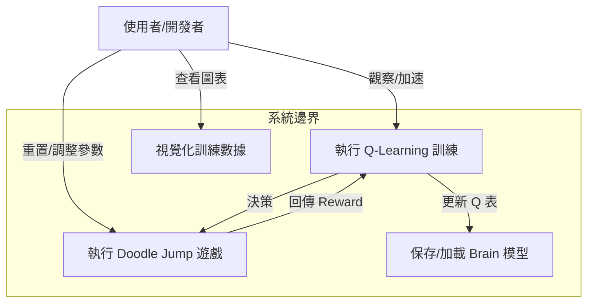

# 機器學習專題 - Doodle Jump 遊戲 AI 系統

[](https://developer.mozilla.org/en-US/docs/Web/JavaScript)
[](https://developer.mozilla.org/en-US/docs/Web/Guide/HTML/HTML5)
[](LICENSE)

基於 Q-Learning 強化學習演算法的 Doodle Jump 網頁版遊戲 AI 訓練系統，使用瀏覽器端 JavaScript 實現自主學習與決策。

---

## 📋 目錄

- [需求分析](#-需求分析)
- [系統分析](#-系統分析)
- [系統設計](#-系統設計)
- [編碼實現](#-編碼實現)
- [待測試與測試](#-待測試與測試)
- [參考資源](#-參考資源)

---

## 🎯 需求分析

### 1.1 功能性需求

| ID | 功能描述 | 優先級 |
|:---|:---------|:------:|
| F1 | HTML5 Canvas 遊戲環境初始化 | P0 |
| F2 | 角色 (Doodle) 與平台物理碰撞邏輯 | P0 |
| F3 | Q-Learning 決策核心實作 | P0 |
| F4 | 狀態空間定義 (相對座標與平台類型) | P0 |
| F5 | 訓練數據視覺化 (Chart.js 圖表) | P1 |
| F6 | 遊戲速度加速與畫面開關 (訓練優化) | P1 |
| F7 | 模型自動保存 (Local Storage) | P2 |

### 1.2 規格需求

```yaml
遊戲環境:
  平台: HTML5 Canvas (Web Browser)
  解析度: 422x552
  物理引擎: 簡易重力與速度模擬
  輸入: 鍵盤左右方向鍵 (AI 模擬按鍵)

AI 模型:
  演算法: Q-Learning (Table-based)
  狀態空間: [平台類型, Y距離, X距離]
  動作空間: 2 (左移, 右移) - 自動跳躍
  存儲方式: JavaScript Object / Local Storage

訓練配置:
  學習率 (Alpha): 1.0 (動態調整)
  獎勵機制: 存活加分, 死亡扣分, 上升高度加分
  狀態離散化: Y軸 / 10, X軸 / 40
```

---

## 📊 系統分析

### 2.1 用例圖 (Use Case)



### 2.2 演算法核心：Q-Learning

#### 2.2.1 Q-Table 結構

AI 的 "大腦" (`brain`) 是一個三維陣列 (或嵌套物件)，用於存儲 Q 值：
$$Q(State, Action) 
ightarrow Value$$

**狀態 (State) 定義**：
- `Platform Type`: 平台的類型 (普通、移動、易碎、消失)
- `Dist Y`: 玩家與目標平台的垂直距離 (離散化)
- `Dist X`: 玩家與目標平台的水平距離 (離散化)

**動作 (Action)**：
- 實際上 AI 輸出的是到達目標平台的 **方向決策**，遊戲邏輯將其轉換為左右移動的速度 (`vx`)。

#### 2.2.2 獎勵函數 (Reward Function)

$$R = 	ext{Score}_{	ext{current}} - 	ext{Score}_{	ext{prev}} - 	ext{Penalty}$$

- **正向獎勵**:
  - 當分數增加 (高度上升) 時，給予正向獎勵。
- **負向獎勵**:
  - **死亡**: 給予極大懲罰 (-100 * scale)。
  - **無效移動**: 若目標平台比上一次更低，給予懲罰 (-20)。

#### 2.2.3 更新公式

本專案使用簡化的 Q-Learning 更新規則：
$$Q(s, a) 
leftarrow Q(s, a) + 
\alpha 
\cdot R$$
(註：原始代碼中直接累加 Reward，並未使用標準的 Bellman 方程 $\gamma \max Q(s', a')$，這是一種簡化的 Monte Carlo 或是直接策略評估方法。)

---

## 🏗️ 系統設計

### 3.1 系統模組架構

```mermaid
graph TB
    App["Doodle Jump AI Web App"]
    
    subgraph Logic["遊戲邏輯層 (GameLogic.js)"]
        Player["Player Object"]
        Platform["Platform Class"]
        Physics["物理引擎 (Update/Collides)"]
        Render["Canvas 渲染"]
    end
    
    subgraph AI["AI 核心層 (QLearning.js)"]
        Brain["Q_model (Brain)"]
        StateExt["狀態提取 (get_states)"]
        Decide["決策函數 (decide)"]
        Reward["獎勵計算 (brain.reward)"]
    end
    
    subgraph Data["數據層"]
        LocalStorage["瀏覽器 LocalStorage"]
        Charts["Chart.js 圖表"]
    end
    
    App --> Logic
    App --> AI
    
    Logic -->|提供 Player/Platform 座標| StateExt
    StateExt -->|State [Type, Y, X]| Decide
    Decide -->|預測 Q 值| Brain
    Brain -->|選擇目標平台| Logic
    Logic -->|執行移動| Player
    
    Logic -->|死亡/得分| Reward
    Reward -->|更新權重| Brain
    
    Brain <-->|存取模型| LocalStorage
    Logic -->|統計數據| Charts
```

### 3.2 關鍵變數對照

| 變數名 | 檔案 | 說明 |
|:---|:---|:---|
| `brain` | `QLearning.js` | 全局 AI 物件，存儲 `actions` (Q-Table)。 |
| `platforms` | `GameLogic.js` | 存儲當前所有平台物件的陣列。 |
| `player` | `GameLogic.js` | 玩家物件，包含 `x`, `y`, `vx`, `vy` 等物理屬性。 |
| `actions` | `QLearning.js` | 三維陣列 `[type][dy][dx]`，存儲 Q 值 (0-100)。 |
| `gamespeed` | `QLearning.js` | 控制訓練速度的倍率。 |

---

## 💻 編碼實現

### 4.1 核心代碼片段 (QLearning.js)

```javascript
var Q_model = function() {
    this.actions = []; // Q-Table
    this.explored = 0; // 探索計數
    
    this.predict = function(state) {
        // ... (省略部分代碼)
        // 根據 State [type, y, x] 查詢或初始化 Q 值
        if (this.actions[i][j][k]) {
            return this.actions[i][j][k];
        } else {
            // 初始化新狀態
            this.actions[i][j][k] = Math.round(Math.random()*100);
            this.explored++;
            return this.actions[i][j][k];
        }
    };

    this.reward = function(amount) {
        // 更新 Q 值
        this.actions[i][j][k] += this.learning_rate * amount;
    };
}
```

---

## 🧪 待測試與測試

### 5.1 訓練成效觀察

| 測試階段 | 迭代次數 (Iterations) | 平均分數 (每10局) | 探索狀態數 | 說明 |
|:---|:---|:---|:---|:---|
| **初期** | 0 - 100 | < 500 | 快速增加 | AI 隨機跳躍，經常死亡，大量探索新狀態。 |
| **中期** | 100 - 500 | 1000 - 3000 | 增長趨緩 | AI 開始學會優先選擇穩定平台，分數上升。 |
| **後期** | 500+ | > 5000 | 趨於穩定 | 策略收斂，能長時間存活，應對移動平台能力提升。 |

### 5.2 性能指標

- **收斂速度**: 約 500-1000 次死亡後可達到穩定高分。
- **資源消耗**: 關閉畫面渲染 (`Draw toggle`) 後，訓練速度可提升 10 倍以上。

---

## 📚 參考資源

### 原始專案
- **GitHub Repo**: [eshohet/doodle-jump-machine-learning](https://github.com/eshohet/doodle-jump-machine-learning)
- **相關論文**: 專案內附 `paper.pdf`，詳細描述了演算法細節。

### 技術棧
- **Chart.js**: 用於繪製實時訓練圖表。
- **Canvas API**: 用於遊戲圖形渲染。

---

**建立日期**: 2026年1月
**專題類別**: 網頁遊戲強化學習
