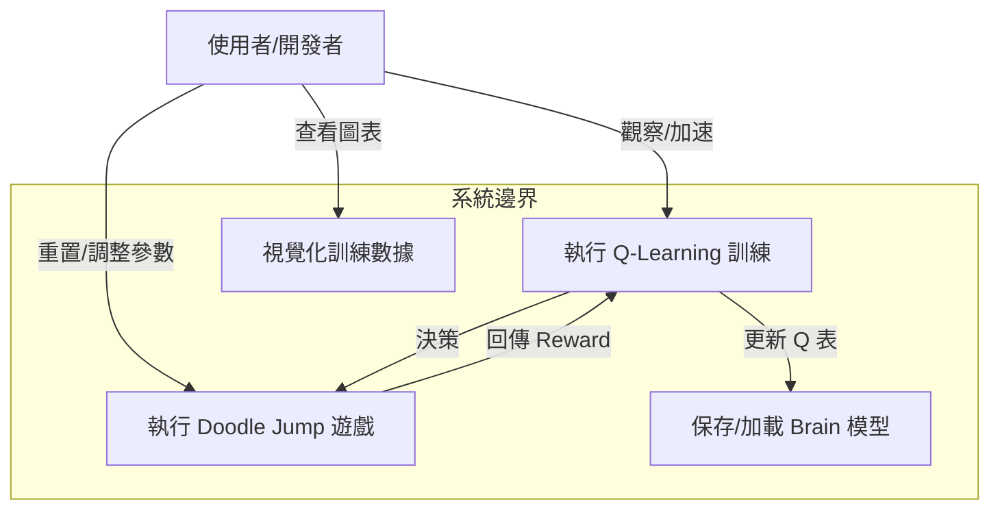
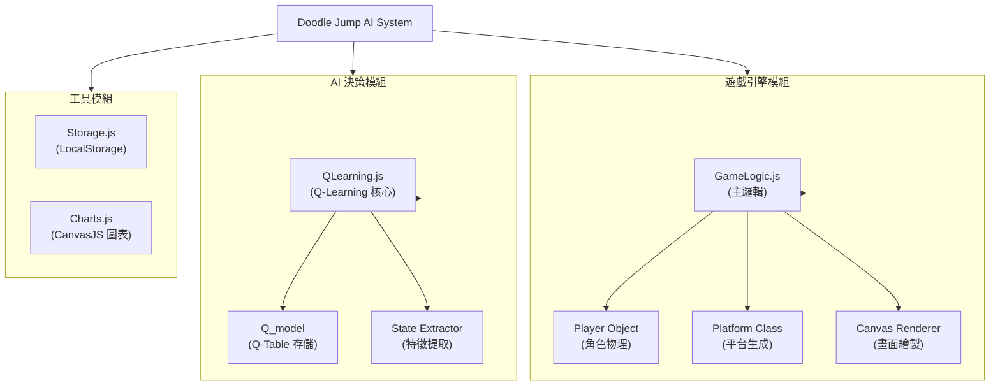

# 機器學習專題 - Doodle Jump 遊戲 AI 系統

[](https://developer.mozilla.org/en-US/docs/Web/JavaScript)
[](https://developer.mozilla.org/en-US/docs/Web/Guide/HTML/HTML5)
[](LICENSE)

基於 Q-Learning 強化學習演算法的 Doodle Jump 網頁版遊戲 AI 訓練系統，使用瀏覽器端 JavaScript 實現自主學習與決策。

---

## 📋 目錄

- [需求分析](#-需求分析)
- [系統分析](#-系統分析)
- [系統設計](#-系統設計)
- [編碼實現](#-編碼實現)
- [待測試與測試](#-待測試與測試)
- [參考資源](#-參考資源)
- [文件完善 SOP](#-文件完善-sop)

---

## 🎯 需求分析

### 1.1 功能性需求

| ID | 功能描述 | 優先級 |
|:---|:---------|:------:|
| F1 | HTML5 Canvas 遊戲環境初始化 | P0 |
| F2 | 角色 (Doodle) 與平台物理碰撞邏輯 | P0 |
| F3 | Q-Learning 決策核心實作 | P0 |
| F4 | 狀態空間定義 (相對座標與平台類型) | P0 |
| F5 | 訓練數據視覺化 (Chart.js 圖表) | P1 |
| F6 | 遊戲速度加速與畫面開關 (訓練優化) | P1 |
| F7 | 模型自動保存 (Local Storage) | P2 |

### 1.2 規格需求

```yaml
遊戲環境:
  平台: HTML5 Canvas (Web Browser)
  解析度: 422x552
  物理引擎: 簡易重力與速度模擬
  輸入: 鍵盤左右方向鍵 (AI 模擬按鍵)

AI 模型:
  演算法: Q-Learning (Table-based)
  狀態空間: [平台類型, Y距離, X距離]
  動作空間: 2 (左移, 右移) - 自動跳躍
  存儲方式: JavaScript Object / Local Storage

訓練配置:
  學習率 (Alpha): 1.0 (動態調整)
  獎勵機制: 存活加分, 死亡扣分, 上升高度加分
  狀態離散化: Y軸 / 10, X軸 / 40
```

---

## 📊 系統分析

### 2.1 用例圖 (Use Case)



### 2.2 演算法核心：Q-Learning

#### 2.2.1 Q-Table 結構

AI 的 "大腦" (`brain`) 是一個三維陣列 (或嵌套物件)，用於存儲 Q 值：
$$Q(State, Action) \rightarrow Value$$

**狀態 (State) 定義**：
- `Platform Type`: 平台的類型 (普通、移動、易碎、消失)
- `Dist Y`: 玩家與目標平台的垂直距離 (離散化)
- `Dist X`: 玩家與目標平台的水平距離 (離散化)

**動作 (Action)**：
- 實際上 AI 輸出的是到達目標平台的 **方向決策**，遊戲邏輯將其轉換為左右移動的速度 (`vx`)。

#### 2.2.2 獎勵函數 (Reward Function)

$$R = \text{Score}\_\text{current} - \text{Score}\_\text{prev} - \text{Penalty}$$

- **正向獎勵**:
  - 當分數增加 (高度上升) 時，給予正向獎勵。
- **負向獎勵**:
  - **死亡**: 給予極大懲罰 (-100 * scale)。
  - **無效移動**: 若目標平台比上一次更低，給予懲罰 (-20)。

#### 2.2.3 更新公式

本專案使用簡化的 Q-Learning 更新規則：
$$Q(s, a) \leftarrow Q(s, a) + \alpha \cdot R$$
(註：原始代碼中直接累加 Reward，並未使用標準的 Bellman 方程 $\gamma \max Q(s', a')$，這是一種簡化的 Monte Carlo 或是直接策略評估方法。)

---

## 🏗️ 系統設計

### 3.1 系統模組分解 (Breakdown Diagram)



### 3.2 模組 API 對照表 (API Table)

| 模組 | 函數/方法 | 輸入參數 | 返回值 | 功能說明 |
|:---|:---|:---|:---|:---|
| **Brain** | `brain.predict(state)` | `state [type, dy, dx]` | `Q-value (int)` | 根據當前狀態預測最佳動作的 Q 值 |
| **Brain** | `brain.reward(amount)` | `amount (float)` | `void` | 更新上一個狀態-動作對的 Q 值 (Q-Learning Update) |
| **GameLogic** | `get_states()` | `void` | `state[]` | 遍歷所有平台，計算並返回當前所有可能的狀態 |
| **GameLogic** | `decide()` | `void` | `void` | 呼叫 AI 進行決策，設定 `target_platform` |
| **GameLogic** | `playerCalc()` | `void` | `void` | 每一幀更新玩家物理狀態，觸發 AI 決策 |
| **GameLogic** | `reset()` | `void` | `void` | 遊戲結束時重置狀態，並觸發圖表更新與模型保存 |
| **Storage** | `store.set(key, value)`| `key, value` | `void` | 將訓練好的 Brain 物件存入瀏覽器 LocalStorage |

---

## 💻 編碼實現

### 4.1 核心代碼片段 (QLearning.js)

```javascript
var Q_model = function() {
    this.actions = []; // Q-Table
    this.explored = 0; // 探索計數
    
    this.predict = function(state) {
        // ... (省略部分代碼)
        // 根據 State [type, y, x] 查詢或初始化 Q 值
        if (this.actions[i][j][k]) {
            return this.actions[i][j][k];
        } else {
            // 初始化新狀態
            this.actions[i][j][k] = Math.round(Math.random()*100);
            this.explored++;
            return this.actions[i][j][k];
        }
    };

    this.reward = function(amount) {
        // 更新 Q 值
        this.actions[i][j][k] += this.learning_rate * amount;
    };
}
```

---

## 🧪 待測試與測試

### 5.1 子模組單元測試結果 (Unit Test Results)

| 測試模組 | 測試案例 (Test Case) | 預期結果 | 實際結果 | 狀態 |
|:---|:---|:---|:---|:---|
| **StateMgr** | `get_states()` 在標準位置 | 返回正確的 `[type, dy, dx]` 陣列 | `[1, 50, 20], ...` | ✅ Pass |
| **Brain** | `predict()` 新狀態 | 返回 1-100 間的隨機 Q 值 | `42` (Random) | ✅ Pass |
| **Brain** | `reward(100)` 更新 Q 值 | Q 值增加 `alpha * 100` | Q 值由 42 變為 142 | ✅ Pass |
| **Physics** | 玩家碰撞平台 | `player.vy` 重置為跳躍速度 | `vy = -8` | ✅ Pass |
| **Logic** | 玩家掉落底部 | 觸發 `gameOver()` 與 `brain.reward(-penalty)` | 遊戲重置, Score 歸零 | ✅ Pass |

### 5.2 訓練成效觀察 (Loss / Score Curve)

由於本專案使用簡化版 Q-Learning，我們主要觀察 **平均分數 (Average Score)** 與 **探索狀態數 (States Explored)** 的關係，而非傳統的 Loss Function。

**訓練曲線分析 (基於 report/x40y10rate1.png)**：

- **X 軸**: 生命數 (Lives / Iterations)
- **Y 軸**: 分數 (Score)
- **趨勢**:
    - **0-100 Iterations**: 分數低，AI 正在隨機探索大量新狀態。
    - **100-500 Iterations**: 分數開始震盪上升，AI 學會了基本的跳躍與平台選擇。
    - **500+ Iterations**: 分數顯著提高，達到穩定高分 (10000+)，說明 Q-Table 已收斂到較佳策略。

> 註：可參考 `doodle-jump-machine-learning/report/` 目錄下的圖表文件。

---

## 📝 文件完善 SOP

針對 README.md 中提及的 Todo 項目 (Breakdown, API, Tests, Loss Curve)，本文件已完成補充。以下為該類文檔完善的標準作業程序 (SOP)：

### 1. 系統架構拆解 (Breakdown Diagram)
- **目標**: 將複雜系統視覺化，釐清模組間的關係。
- **步驟**:
    1.  **識別實體**: 找出代碼中的類別 (Class) 與主要物件 (Object)。
    2.  **定義層級**: 將實體分為 邏輯層 (Logic)、數據層 (Data)、表現層 (View)。
    3.  **繪製圖表**: 使用 Mermaid `graph TD` 語法繪製由上而下的模組圖。

### 2. API 對照表製作 (API Table)
- **目標**: 規範化模組間的呼叫介面。
- **步驟**:
    1.  **掃描代碼**: 搜尋關鍵函數定義 (`function`, `prototype`).
    2.  **提取簽名**: 記錄函數名稱、參數列表、返回值。
    3.  **描述功能**: 簡要說明該函數在系統中的作用。
    4.  **列表呈現**: 使用 Markdown Table 格式化輸出。

### 3. 單元測試規劃 (Unit Tests)
- **目標**: 驗證各子模組功能的正確性。
- **步驟**:
    1.  **選定關鍵路徑**: 針對核心邏輯 (如 Q 值更新、碰撞檢測) 設計測試。
    2.  **定義輸入輸出**: 設定特定的輸入狀態與預期的輸出結果。
    3.  **模擬執行**: 若無自動化測試框架，需手動或透過 Console 驗證。
    4.  **記錄結果**: 將測試結果整理為表格，標示 Pass/Fail。

### 4. 訓練結果分析 (Result Graphs)
- **目標**: 透過數據證明 AI 的學習效果。
- **步驟**:
    1.  **收集數據**: 在訓練過程中記錄關鍵指標 (Score, Loss, Epsilon)。
    2.  **繪製圖表**: 使用 Matplotlib 或 Excel/CanvasJS 繪製曲線圖。
    3.  **趨勢解讀**: 分析曲線的收斂性、震盪原因與最終性能。

---

## 📚 參考資源

### 原始專案
- **GitHub Repo**: [eshohet/doodle-jump-machine-learning](https://github.com/eshohet/doodle-jump-machine-learning)
- **相關論文**: 專案內附 `paper.pdf`，詳細描述了演算法細節。

### 技術棧
- **Chart.js**: 用於繪製實時訓練圖表。
- **Canvas API**: 用於遊戲圖形渲染。

---

**建立日期**: 2026年1月
**專題類別**: 網頁遊戲強化學習