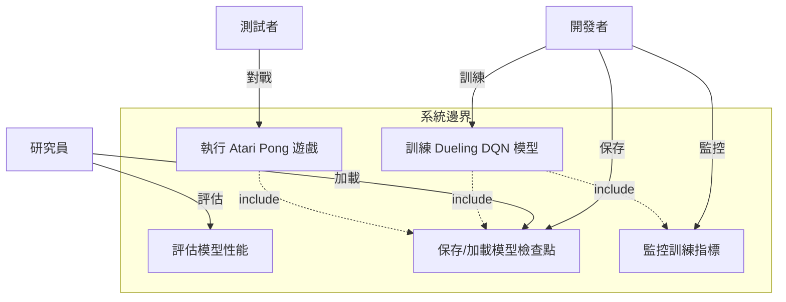
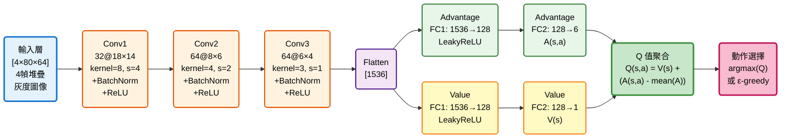
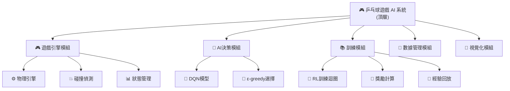

# 機器學習專題 - 乒乓球遊戲 AI 系統

[](https://www.python.org/)
[](https://pytorch.org/)
[](https://gym.openai.com/)
[](LICENSE)

基於 Dueling Double DQN 算法的 Atari Pong 遊戲 AI 訓練系統，使用視覺輸入實現自主學習與決策。

---

## 📋 目錄

- [需求分析](#-需求分析)
- [系統分析](#-系統分析)
- [系統設計](#-系統設計)
- [編碼實現](#-編碼實現)
- [待測試與測試](#-待測試與測試)
- [參考資源](#-參考資源)
- [簡報 Todo](#簡報-todo)

---

## 簡報 Todo

| 日期 | 項目 |
| :-- | :-- |
| 1211 | 關於 `ping-pong-ai-project.md`：1) Dueling 的目標 Q 值在 `Ben_DQN.py` 中目標 Q 值是多少？ 2) Dueling Q 值計算公式中的 A 值代表 reward 嗎？在 `Ben_DQN.py` 中每次給的 reward 是多少？ |
| 1218 | (空 / 待補) |

### 1211 — 回答與說明
1) Ben_DQN.py 中的目標 Q 值（target Q）：
   - target Q 在程式中計算為：
     `expected_q_value = reward + gamma * next_states_target_q_value * (1 - done)`
   - next_states_target_q_value 的來源：
     - 使用 Double DQN：online network 選擇 argmax 動作（`next_states_q_values.max(1)[1]`），再由 target network 在該動作索引處評估 Q 值（`next_states_target_q_values.gather(...)`）。
   - 因此，形式上等同於：
     `target = r + γ * Q_target(s', argmax_a Q_online(s', a))`

2) A（Advantage）是否等於 reward？Ben_DQN.py 中每次 reward 為多少？
   - A 不是 reward。A(s,a) 在 Dueling network 表示 advantage（動作相對於該狀態的相對優勢值），用來和狀態價值 V(s) 合成 Q(s,a)：`Q = V + (A - mean(A))`。
   - Ben_DQN.py 中的 reward 是由環境在 `environment.step(action)` 中回傳。
   - 依本專案與典型 Atari Pong 設計，環境回傳的即時 reward 常見集合為 {-1, 0, +1}。

---

## 🎯 需求分析

### 1.1 功能性需求

| ID | 功能描述 | 優先級 |
|:---|:---------|:------:|
| F1 | OpenAI Gym 環境初始化 | P0 |
| F2 | 圖像預處理與狀態管理 | P0 |
| F3 | AI 決策與動作執行 | P0 |
| F4 | 經驗回放機制 | P0 |
| F5 | Dueling DQN 網絡訓練 | P0 |
| F6 | 目標網絡同步更新 | P1 |
| F7 | 模型保存與加載 | P1 |
| F8 | 訓練結果視覺化 | P2 |

### 1.2 規格需求

```yaml
遊戲環境:
  環境名稱: PongDeterministic-v4
  原始輸入: 210×160×3 RGB 圖像
  處理後輸入: 80×64×4 灰度圖像 (4幀堆疊)
  動作空間: 6 (Atari 標準動作集)

AI 模型:
  輸入維度: [4, 80, 64] (通道×高×寬)
  輸出動作空間: 6
  網絡類型: Dueling CNN
  推理延遲: GPU <10 ms, CPU <50 ms

訓練配置:
  最大記憶容量: 50,000 transitions
  最小訓練記憶: 40,000 transitions
  批次大小: 64
  目標網絡更新: 每 episode 結束
```

---

## 📊 系統分析

### 2.1 用例圖 (Use Case)



### 2.2 參數與損失函數的含義

#### 2.2.1 Dueling DQN 參數定義

**完整參數集合**:
$$\theta = \{W_{conv1}, b_{conv1}, \gamma_{bn1}, \beta_{bn1}, ..., W_A, b_A, W_V, b_V\$$

其中 Dueling 架構包含：
- **共享卷積層**: 3層CNN提取視覺特徵
- **動作優勢流 (Advantage Stream)**: $A(s,a)$ - 評估各動作相對優勢
- **狀態價值流 (Value Stream)**: $V(s)$ - 評估當前狀態整體價值

| 項目                 | 定義                                    | 遊戲中的代表意義           | 機制說明 |
|----------------------|-----------------------------------------|--------------------------|---------|
| **θ (模型參數)**     | DQN 神經網絡的所有權重與偏置            | AI大腦中決定動作的知識     | 每個神經元的連接強度，決定狀態→Q值的映射 |
| **初始 θ₀**         | 隨機初始化的小值                        | 訓練前AI對遊戲一無所知     | 隨機權重導致決策亂猜 |
| **更新後 θ*/θ_best** | 訓練完成後的最優參數                    | 經過學習的AI大腦           | 經過1000局訓練，已學會預測球的軌跡 |
| **∇θ (梯度)**       | 損失函數相對參數的偏導數                | AI改進的方向指示           | 告訴優化器應該增加還是減少某個參數 |

#### 2.2.1.1 網絡架構圖



**Dueling Q 值計算**:
$$Q(s,a) = V(s) + \left(A(s,a) - \frac{1}{|A|} \sum_{a'} A(s,a')\right)$$

#### 2.2.1.2 CNN 網絡參數表

| 層級 | 類型 | 輸入維度 | 輸出維度 | 核大小 | 步長 | 參數量 |
|:-----|:-----|:---------|:---------|:-------|:-----|:-------:|
| Conv1 | Conv2d | 4×80×64 | 32×18×14 | 8×8 | 4 | 8,224 |
| BN1 | BatchNorm2d | 32×18×14 | 32×18×14 | - | - | 64 |
| Conv2 | Conv2d | 32×18×14 | 64×8×6 | 4×4 | 2 | 32,832 |
| BN2 | BatchNorm2d | 64×8×6 | 64×8×6 | - | - | 128 |
| Conv3 | Conv2d | 64×8×6 | 64×6×4 | 3×3 | 1 | 36,928 |
| BN3 | BatchNorm2d | 64×6×4 | 64×6×4 | - | - | 128 |

**總參數量**: ~472,679

#### 2.2.1.3 損失函數與核心機制

**核心損失函數**:
$$L(\theta) = \mathbb{E}\left[(r + \gamma \max_{a'} Q_{\theta^-}(s', a') - Q_\theta(s, a))^2\right]$$

| 機制 | 作用 |
|:---|:---|
| **Double DQN** | 用當前網絡選擇動作, 用目標網絡評估價值，避免過度樂觀 |
| **Dueling Network** | 分離狀態價值與動作優勢估計，提升學習效率 |
| **經驗回放** | 打破時間相關性, 高效利用數據 |

---

## 🏗️ 系統設計

### 3.1 系統模組分支圖



---

## 📚 參考資源

### 論文與文獻

1. **Double DQN**: Van Hasselt, et al. (2016)
2. **Dueling DQN**: Wang, et al. (2016)
3. **DQN**: Mnih, et al. (2015)

---

**最後更新**: 2026年1月
**版本**: 1.3 (深度整合與衝突修復)