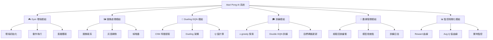
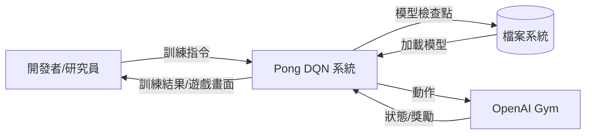
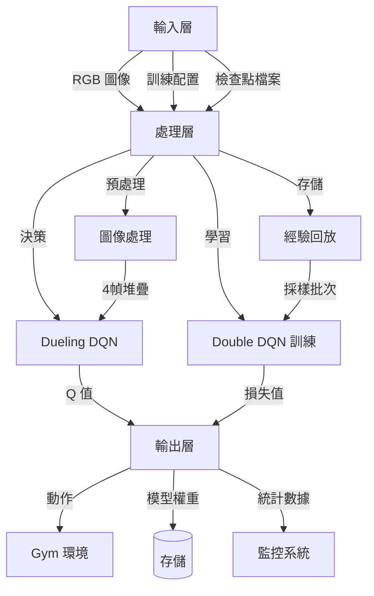
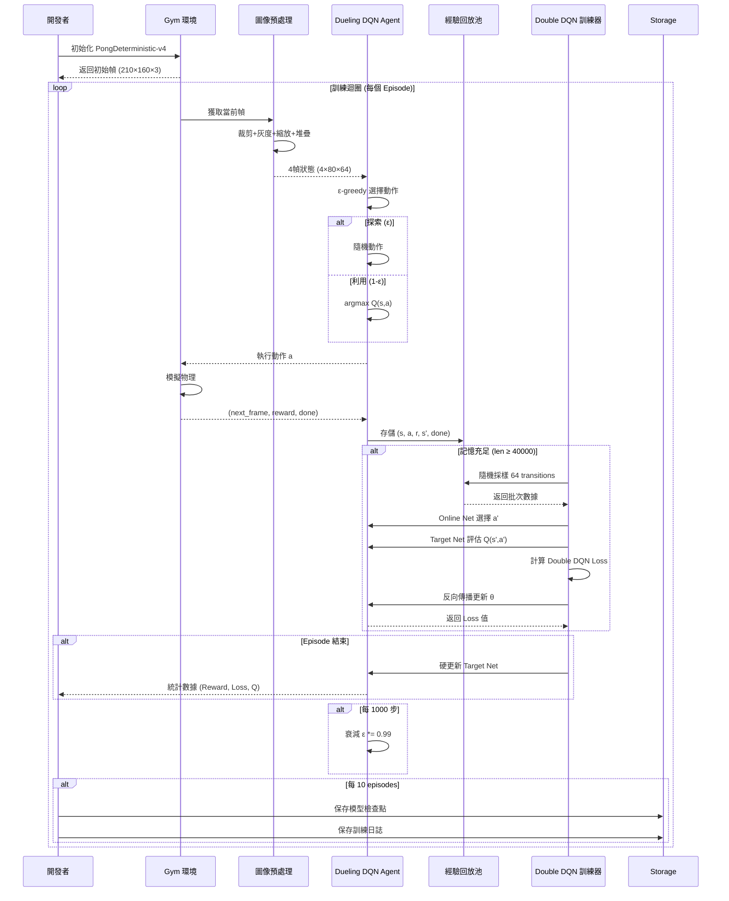
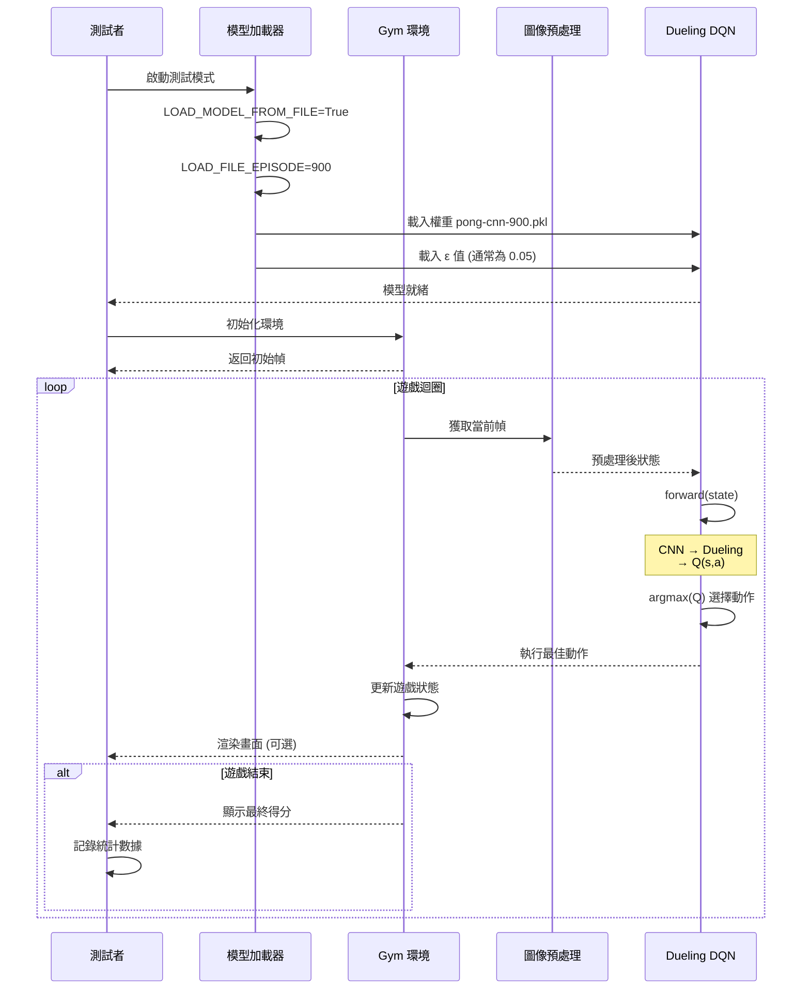
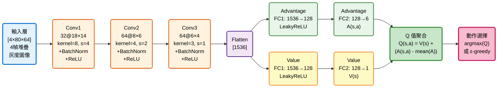
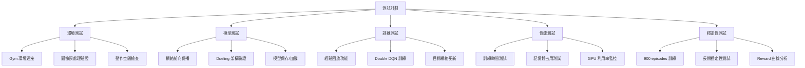

# 機器學習專題 - 乒乓球遊戲 AI 系統

[](https://www.python.org/)
[](https://pytorch.org/)
[](https://gym.openai.com/)
[](LICENSE)

基於 Dueling Double DQN 算法的 Atari Pong 遊戲 AI 訓練系統，使用視覺輸入實現自主學習與決策。

---

## 📋 目錄

- [需求分析](#-需求分析)
- [系統分析](#-系統分析)
- [系統設計](#-系統設計)
- [編碼實現](#-編碼實現)
- [待測試與測試](#-待測試與測試)
- [參考資源](#-參考資源)

---

## 🎯 需求分析

### 1.1 功能性需求

| ID | 功能描述 | 優先級 |
|:---|:---------|:------:|
| F1 | OpenAI Gym 環境初始化 | P0 |
| F2 | 圖像預處理與狀態管理 | P0 |
| F3 | AI 決策與動作執行 | P0 |
| F4 | 經驗回放機制 | P0 |
| F5 | Dueling DQN 網絡訓練 | P0 |
| F6 | 目標網絡同步更新 | P1 |
| F7 | 模型保存與加載 | P1 |
| F8 | 訓練結果視覺化 | P2 |

### 1.2 規格需求

```yaml
遊戲環境:
  環境名稱: PongDeterministic-v4
  原始輸入: 210×160×3 RGB 圖像
  處理後輸入: 80×64×4 灰度圖像 (4幀堆疊)
  動作空間: 6 (Atari 標準動作集)

AI 模型:
  輸入維度: [4, 80, 64] (通道×高×寬)
  輸出動作空間: 6
  網絡類型: Dueling CNN
  推理延遲: GPU <10 ms, CPU <50 ms

訓練配置:
  最大記憶容量: 50,000 transitions
  最小訓練記憶: 40,000 transitions
  批次大小: 64
  目標網絡更新: 每 episode 結束
```

### 1.3 效能需求

| 指標 | 目標值 | 驗收標準 |
|:-----|:-------|:---------|
| 訓練收斂 | 900 episodes | Reward 曲線穩定正值 |
| 平均獎勵 (100局) | ≥15 | 最後 100 episodes 平均 |
| 訓練時間 | ≤7 小時 | Google Colab GPU 環境 |
| 模型穩定性 | σ <15% | 標準差計算 |
| 推理延遲 | <50 ms | 單次動作決策 (CPU) |
| 記憶體占用 | ≤2GB | 訓練時 GPU 記憶體 |

### 1.4 驗收方法

```
驗收測試體系
│
├─ 功能驗收
│  ├─ 環境連接測試
│  ├─ 圖像預處理驗證
│  └─ 模型載入測試
│
├─ 性能驗收
│  ├─ 900 episodes 訓練完成
│  ├─ Reward 曲線分析
│  └─ 記憶體壓力測試
│
├─ 模型驗收
│  ├─ 100 局對戰測試
│  ├─ Q 值穩定性評估
│  └─ 探索率衰減驗證
│
└─ 用戶驗收
   ├─ 代碼可讀性
   ├─ 訓練日誌完整性
   └─ 模型可重現性
```

---

## 📊 系統分析

### 2.2 參數與損失函數的含義

#### 2.2.1 Dueling DQN 參數定義

**完整參數集合**:
$$\theta = \{W_{conv1}, b_{conv1}, \gamma_{bn1}, \beta_{bn1}, ..., W_A, b_A, W_V, b_V\}$$

其中 Dueling 架構包含：
- **共享卷積層**: 3層CNN提取視覺特徵
- **動作優勢流 (Advantage Stream)**: \(A(s,a)\) - 評估各動作相對優勢
- **狀態價值流 (Value Stream)**: \(V(s)\) - 評估當前狀態整體價值

**Dueling Q 值計算**:
$$Q(s,a) = V(s) + \left(A(s,a) - \frac{1}{|A|} \sum_{a'} A(s,a')\right)$$

#### 2.2.2 Double DQN 損失函數

**標準 DQN 問題**: 容易過估計 Q 值  
**Double DQN 解決方案**: 解耦動作選擇與評估

**Double DQN 目標計算**:


Q_target = r + γ · Q_target_net(s', argmax_a' Q_online_net(s', a'))


**實現步驟**:
1. 用 **Online Network** 選擇最佳動作: `a* = argmax_a' Q_θ(s', a')`
2. 用 **Target Network** 評估該動作價值: `Q_θ-(s', a*)`

**損失函數**:


**損失函數**:
$$L(\theta) = \mathbb{E}\left[(Q_{target} - Q_\theta(s,a))^2\right]$$

**訓練階段演變**:

| 階段 | Episodes | Loss 範圍 | ε 值 | Reward 趨勢 |
|:-----|:---------|:----------|:-----|:-----------|
| 探索期 | 0-200 | 高且不穩定 | 1.0→0.6 | -21 (持續失分) |
| 學習期 | 200-600 | 逐漸下降 | 0.6→0.2 | -21→0 (開始接球) |
| 突破期 | 600-900 | 穩定低值 | 0.2→0.05 | 0→+15 (穩定得分) |
| 專家期 | 900+ | 平穩 | 0.05 | +15~+20 (高水平) |

#### 2.2.3 圖像預處理流程

**原始輸入處理**:
```
Atari 原始幀 (210×160×3 RGB)
  │
  ├─ Step 1: 裁剪計分板 [20:210, 0:160]
  │  └─ 移除頂部 20px 計分區域
  │
  ├─ Step 2: 灰度轉換
  │  └─ cv2.cvtColor(COLOR_BGR2GRAY)
  │
  ├─ Step 3: 縮放至目標尺寸
  │  └─ cv2.resize() → (64, 80)
  │
  ├─ Step 4: 正規化
  │  └─ pixel_value / 255.0
  │
  └─ Step 5: 幀堆疊 (提供運動資訊)
     └─ Stack 4 連續幀 → (4, 80, 64)
```

**為何需要 4 幀堆疊?**
- 單幀無法判斷球的移動方向和速度
- 4 幀提供時間維度資訊 (類似影片)
- 網絡能從序列幀中學習運動模式

---

## 🏗️ 系統設計

### 3.1 系統模組分支圖



### 3.2 資料流圖 (Data Flow Diagram)

#### Level 0: 系統脈絡圖



#### Level 1: 主要流程圖



### 3.3 訓練流程序列圖 (Training MSC)



### 3.4 推理流程序列圖 (Inference MSC)



### 3.5 技術選型

| 層級 | 技術 | 版本 | 用途 |
|:-----|:-----|:-----|:-----|
| **遊戲環境** | OpenAI Gym[atari] | 0.17+ | Atari 遊戲模擬器 |
| **ML 框架** | PyTorch | 1.5+ | 神經網絡建構與訓練 |
| **RL 算法** | Dueling Double DQN | - | 強化學習核心算法 |
| **優化器** | Adam | - | 參數更新 (α=0.00025) |
| **圖像處理** | OpenCV (cv2) | 4.0+ | 圖像預處理 |
| **GPU 加速** | CUDA | 10.0+ | 訓練加速 (可選) |
| **程式語言** | Python | 3.6+ | 主要開發語言 |
| **數據結構** | collections.deque | - | 經驗回放池 |
| **數值計算** | NumPy | 1.18+ | 陣列運算 |

### 3.6 Dueling DQN 神經網絡結構 (完整版)

#### 3.6.1 網絡架構圖



#### 3.6.2.1 CNN 網絡參數表

| 層級 | 類型 | 輸入維度 | 輸出維度 | 核大小 | 步長 | 參數量 |
|:-----|:-----|:---------|:---------|:-------|:-----|:-------|
| Conv1 | Conv2d | 4×80×64 | 32×18×14 | 8×8 | 4 | 8,224 |
| BN1 | BatchNorm2d | 32×18×14 | 32×18×14 | - | - | 64 |
| Conv2 | Conv2d | 32×18×14 | 64×8×6 | 4×4 | 2 | 32,832 |
| BN2 | BatchNorm2d | 64×8×6 | 64×8×6 | - | - | 128 |
| Conv3 | Conv2d | 64×8×6 | 64×6×4 | 3×3 | 1 | 36,928 |
| BN3 | BatchNorm2d | 64×6×4 | 64×6×4 | - | - | 128 |

**Dueling 分支參數**:

| 分支 | 層級 | 輸入 | 輸出 | 參數量 | 作用 |
|:-----|:-----|:-----|:-----|:-------|:-----|
| **Advantage** | Linear1 | 1536 | 128 | 196,736 | 動作優勢提取 |
| | Linear2 | 128 | 6 | 774 | 6個動作優勢值 |
| **Value** | Linear1 | 1536 | 128 | 196,736 | 狀態價值提取 |
| | Linear2 | 128 | 1 | 129 | 單一狀態價值 |

**總參數量**: ~472,679

#### 3.6.2.2 訓練超參數對照表

| 參數名 | 符號 | OpenAIPong 設定 | 範圍 | 作用 |
|:-------|:-----|:----------------|:-----|:-----|
| 學習率 | α | **0.00025** | [0.0001, 0.001] | Adam 優化器步長 |
| 折扣因子 | γ | **0.97** | [0.95, 0.99] | 未來獎勵權重 |
| 批次大小 | B | **64** | [32, 128] | 梯度估計樣本數 |
| 最大記憶容量 | M_max | **50,000** | [10K, 100K] | 經驗池上限 |
| 最小訓練記憶 | M_min | **40,000** | [5K, 50K] | 開始訓練門檻 |
| ε 初始值 | ε₀ | **1.0** | [0.8, 1.0] | 初始探索率 |
| ε 最小值 | ε_min | **0.05** | [0.01, 0.1] | 最低探索率 |
| ε 衰減率 | ε_decay | **0.99** | [0.99, 0.9999] | 每1000步衰減 |
| 目標網絡更新 | τ_freq | **每 episode** | [1, 100] | 硬更新頻率 |
| 最大 episodes | N_ep | **100,000** | [500, 100K] | 訓練上限 |

#### 3.6.2.3 完整參數計算表

**卷積層輸出尺寸計算公式**:

輸出尺寸 = (輸入尺寸 - 核大小 + 2 × 填充) / 步長 + 1

| 層級 | 層類型 | 輸入維度 | 輸出維度 | 權重數 | 偏置數 | BN 參數 | 總參數 | 激活函數 |
|:-----|:-------|:---------|:---------|:-------|:-------|:--------|:---------|:---------|
| Input | - | 4×80×64 | 4×80×64 | - | - | - | - | - |
| **Conv1** | Conv2d | 4×80×64 | 32×18×14 | 8,192 | 32 | 64 | **8,288** | ReLU |
| **Conv2** | Conv2d | 32×18×14 | 64×8×6 | 32,768 | 64 | 128 | **32,960** | ReLU |
| **Conv3** | Conv2d | 64×8×6 | 64×6×4 | 36,864 | 64 | 128 | **37,056** | ReLU |
| Flatten | - | 64×6×4 | 1536 | - | - | - | - | - |
| **A-FC1** | Linear | 1536 | 128 | 196,608 | 128 | - | **196,736** | LeakyReLU |
| **A-FC2** | Linear | 128 | 6 | 768 | 6 | - | **774** | Linear |
| **V-FC1** | Linear | 1536 | 128 | 196,608 | 128 | - | **196,736** | LeakyReLU |
| **V-FC2** | Linear | 128 | 1 | 128 | 1 | - | **129** | Linear |
| | | | | | | **總計** | **472,679** | |

#### 3.6.3 前向傳播公式

**卷積特徵提取階段**:
$$z_1 = \text{Conv1}(x)$$
$$a_1 = \text{ReLU}(\text{BatchNorm}(z_1))$$
$$a_2 = \text{ReLU}(\text{BatchNorm}(\text{Conv2}(a_1)))$$
$$a_3 = \text{ReLU}(\text{BatchNorm}(\text{Conv3}(a_2)))$$
$$f = \text{Flatten}(a_3) \in \mathbb{R}^{1536}$$

**Dueling 分支階段**:

*動作優勢流*:
$$A_1 = \text{LeakyReLU}(W_A^{(1)} \cdot f + b_A^{(1)})$$
$$A(s,a) = W_A^{(2)} \cdot A_1 + b_A^{(2)} \in \mathbb{R}^6$$

*狀態價值流*:
$$V_1 = \text{LeakyReLU}(W_V^{(1)} \cdot f + b_V^{(1)})$$
$$V(s) = W_V^{(2)} \cdot V_1 + b_V^{(2)} \in \mathbb{R}$$

**Q 值聚合 (Dueling 核心)**:
$$Q(s,a) = V(s) + \left(A(s,a) - \frac{1}{|\mathcal{A}|} \sum_{a'} A(s,a')\right)$$

其中減去均值確保 \(V(s)\) 和 \(A(s,a)\) 的唯一可識別性。

#### 3.6.4 網絡初始化策略

```python
# 卷積層權重: Kaiming 初始化 (適合 ReLU)
W_conv ~ Kaiming Normal (mode='fan_in', nonlinearity='relu')

# 全連接層權重: PyTorch 預設 Uniform
W_fc ~ Uniform[-√(1/n_in), √(1/n_in)]

# 所有偏置: 零初始化
b = 0

# BatchNorm 參數
γ = 1  # Scale parameter
β = 0  # Shift parameter
```

---

## 💻 編碼實現

### 4.1 核心代碼結構

```
OpenAIPong-DQN/
├── pong.py                    # 主程式 (完整實現)
├── OpenAIPong_DQN.ipynb      # Colab 筆記本版本
├── models/                    # 模型檢查點目錄
│   ├── pong-cnn-10.pkl
│   ├── pong-cnn-10.json
│   ├── ...
│   └── pong-cnn-900.pkl      # 最終訓練模型
├── reward.png                 # 訓練 Reward 曲線圖
├── avgQ.png                   # 平均 Q 值曲線圖
├── mov.gif                    # 訓練後遊戲演示
├── README.md                  # 專案說明
├── LICENSE                    # MIT 授權
└── .gitignore
```

### 4.3 配置參數完整表

```python
# ==================== 環境配置 ====================
ENVIRONMENT = "PongDeterministic-v4"
DEVICE = torch.device("cuda" if torch.cuda.is_available() else "cpu")

# ==================== 訓練配置 ====================
TRAIN_MODEL = True              # 訓練模式開關
RENDER_GAME_WINDOW = False      # 是否顯示遊戲畫面 (Colab 不支援)
MAX_EPISODE = 100000            # 最大訓練 episodes
MAX_STEP = 100000               # 每個 episode 最大步數

# ==================== 模型管理 ====================
SAVE_MODELS = True              # 是否保存模型
MODEL_PATH = "./models/pong-cnn-"  # 模型保存路徑
SAVE_MODEL_INTERVAL = 10        # 每 N episodes 保存一次

LOAD_MODEL_FROM_FILE = False    # 是否從檔案加載模型
LOAD_FILE_EPISODE = 0           # 加載第 N episode 的模型

# ==================== DQN 超參數 ====================
BATCH_SIZE = 64                 # 訓練批次大小
MAX_MEMORY_LEN = 50000          # 經驗回放池最大容量
MIN_MEMORY_LEN = 40000          # 開始訓練的最小記憶量

GAMMA = 0.97                    # 折扣因子
ALPHA = 0.00025                 # 學習率 (Adam)
EPSILON_DECAY = 0.99            # Epsilon 衰減率 (每 1000 步)

# ==================== 圖像預處理 ====================
TARGET_HEIGHT = 80              # 目標圖像高度
TARGET_WIDTH = 64               # 目標圖像寬度
CROP_TOP = 20                   # 裁剪頂部像素數 (移除計分板)
NUM_FRAMES = 4                  # 幀堆疊數量
```

---

## ✅ 待測試與測試

### 5.1 測試計劃



### 5.2 模型評估指標

#### 訓練過程監控

```python
# 關鍵指標
metrics = {
    'episode': [],                  # Episode 編號
    'reward': [],                   # 每局總獎勵
    'loss': [],                     # 訓練損失
    'avg_q': [],                    # 平均 Q 值
    'epsilon': [],                  # 當前探索率
    'duration': [],                 # Episode 時長 (秒)
    'steps': [],                    # Episode 步數
    'last_100_avg_reward': []       # 最近 100 局平均獎勵
}
```

**評估公式**:

1. **移動平均獎勵 (100 episodes)**: 
$$R_{avg}(t) = \frac{1}{100}\sum_{i=t-99}^{t} R_i$$

2. **Double DQN 損失函數**: 
L(θ) = E[(r + γ·Q_θ-(s', a*) - Q_θ(s,a))²]

3. **探索率衰減 (每 1000 步)**: 
$$\epsilon_t = \max(\epsilon_{min}, \epsilon_{t-1} \cdot 0.99)$$

4. **平均 Q 值**: 
$$\bar{Q}(episode) = \frac{1}{N_{steps}} \sum_{t=1}^{N_{steps}} \max_a Q_\theta(s_t, a)$$

### 5.3 性能基準測試結果

| 指標 | 目標值 | 預期結果 | 狀態 |
|:-----|:-------|:---------|:-----|
| 訓練收斂 | 900 episodes | **待測試** | ⏳ 待測試 |
| 訓練時間 | ≤7 小時 | **待測試** | ⏳ 待測試 |
| 最終平均獎勵 | ≥15 | **待測試** | ⏳ 待測試 |
| 推理延遲 (GPU) | <10 ms | **待測試** | ⏳ 待測試 |
| 推理延遲 (CPU) | <50 ms | **待測試** | ⏳ 待測試 |
| 記憶體占用 | ≤2GB | **待測試** | ⏳ 待測試 |
| 模型檔案大小 | ~2MB | **待測試** | ⏳ 待測試 |

**測試環境**:
- **GPU**: 待配置
- **CPU**: 待配置
- **RAM**: 待配置
- **PyTorch**: 1.5+

### 5.4 訓練曲線分析

**預期訓練曲線** (參考 OpenAIPong-DQN):

```
Reward 曲線 (900 episodes)
  20 |                                      ╱━━━━━━
     |                                 ╱━━━━
  10 |                            ╱━━━━
     |                      ╱━━━━
   0 |━━━━━━━━━━━━━━━╱━━━━
     |         ╱━━━━
 -10 |    ╱━━━
     | ╱━━
 -20 |━
     +━━━━━━━━━━━━━━━━━━━━━━━━━━━━━━━━━━━━━━━━━→ Episodes
     0   100  200  300  400  500  600  700  800  900

Avg Q 值曲線
  10 |                                  ╱━━━━━━━━━━
     |                             ╱━━━━
   5 |                        ╱━━━━
     |                   ╱━━━━
   0 |━━━━━━━━━━━━━╱━━━━
     |        ╱━━━━
  -5 |   ╱━━━
     |━━━
 -10 |
     +━━━━━━━━━━━━━━━━━━━━━━━━━━━━━━━━━━━━━━━━━→ Episodes
     0   100  200  300  400  500  600  700  800  900

Loss 曲線
 0.5 |━━╲╲
     |    ╲╲╲___
 0.3 |        ╲╲╲___
     |             ╲╲╲___
 0.1 |                  ━━━━━━━━━━━━━━━━━━━━━━━━
     |
 0.0 +━━━━━━━━━━━━━━━━━━━━━━━━━━━━━━━━━━━━━━━━━→ Episodes
     0   100  200  300  400  500  600  700  800  900
```

**階段分析**:

| Episodes | 階段 | Reward 範圍 | ε 值 | 行為特徵 |
|:---------|:-----|:-----------|:-----|:---------|
| 0-200 | 隨機探索期 | -21 ~ -18 | 1.0 → 0.6 | 完全失分,未學會接球 |
| 200-400 | 初步學習期 | -18 ~ -5 | 0.6 → 0.3 | 開始偶爾接到球 |
| 400-600 | 能力提升期 | -5 ~ +5 | 0.3 → 0.15 | 能接多次球,開始得分 |
| 600-800 | 策略優化期 | +5 ~ +15 | 0.15 → 0.08 | 穩定得分,少失分 |
| 800-900 | 專家級期 | +15 ~ +20 | 0.08 → 0.05 | 高水平對抗,長時間保持優勢 |

### 5.5 常見問題排查表

| 問題 | 可能原因 | 解決方案 |
|:-----|:---------|:---------|
| **訓練不收斂** | 學習率過大 | 確認 α=0.00025 |
| | 記憶池未滿 | 確認 len(memory) ≥ 40000 再訓練 |
| | Target 未更新 | 每 episode 結束硬更新 |
| **Reward 長期負值** | ε 衰減太快 | 檢查衰減率 0.99, 每 1000 步 |
| | 批次太小 | 確認 BATCH_SIZE=64 |
| **記憶體溢出** | 記憶池過大 | 降低 MAX_MEMORY_LEN 至 30000 |
| | 圖像未釋放 | 使用 deque 自動管理 |
| **Loss 爆炸** | 梯度未裁剪 | 添加 `torch.nn.utils.clip_grad_norm_()` |
| | Reward 未限制 | Atari 環境 reward 已標準化至 ±1 |
| **Q 值異常** | Dueling 聚合錯誤 | 檢查 `Q = V + (A - A.mean())` |
| | BatchNorm 未啟用 | 訓練時 `model.train()` |
| **圖像預處理錯誤** | 裁剪維度錯誤 | 使用 `cv2.imshow()` 檢查 |
| | 幀堆疊順序錯誤 | 確認 `np.stack((new, old[0], old[1], old[2]))` |
| **模型載入失敗** | 檔案路徑錯誤 | 確認 `MODEL_PATH` 正確 |
| | epsilon 未載入 | 同時載入 .json 檔案 |
| **Colab 斷線** | 訓練時間過長 | 每 10 episodes 保存檢查點 |
| | GPU 超時 | 使用 Colab Pro 或本地訓練 |

### 5.6 功能驗收檢查表

| ID | 功能項目 | 測試方法 | 通過標準 | 狀態 |
|:---|:---------|:---------|:---------|:-----|
| F1 | Gym 環境初始化 | `env = gym.make()` | 返回 (210,160,3) 圖像 | ⏳ 待測試 |
| F2 | 圖像預處理 | 視覺檢查 | 輸出 (80,64) 灰度圖 | ⏳ 待測試 |
| F3 | 4幀堆疊 | Shape 檢查 | (4, 80, 64) | ⏳ 待測試 |
| F4 | Dueling DQN 前向 | 單元測試 | 輸出 (batch, 6) Q 值 | ⏳ 待測試 |
| F5 | ε-greedy 決策 | 統計測試 | 探索率符合設定 | ⏳ 待測試 |
| F6 | 經驗回放採樣 | 集成測試 | 隨機均勻採樣 64 筆 | ⏳ 待測試 |
| F7 | Double DQN 訓練 | Loss 監控 | Loss 逐漸下降 | ⏳ 待測試 |
| F8 | 目標網絡更新 | 參數檢查 | 每 episode 同步 | ⏳ 待測試 |
| F9 | 模型保存 | 檔案測試 | .pkl + .json 完整 | ⏳ 待測試 |
| F10 | 模型加載 | 推理測試 | 恢復訓練狀態 | ⏳ 待測試 |
| F11 | 訓練日誌 | 檔案檢查 | out.txt 記錄完整 | ⏳ 待測試 |
| F12 | 900 episodes 收斂 | 長期測試 | Reward ≥ 15 | ⏳ 待測試 |

### 5.7 壓力測試

**測試場景**:
- 連續運行 900 episodes (約 7 小時)
- GPU 記憶體監控
- 記憶體洩漏檢測
- 模型檢查點完整性驗證

**測試結果**:
```
⏳ 待測試
```

---

## 📚 參考資源

### 論文與文獻

1. **Mnih et al. (2013)** - [Playing Atari with Deep Reinforcement Learning](https://arxiv.org/abs/1312.5602)  
   *NIPS Deep Learning Workshop* - **DQN 原始論文**

2. **Mnih et al. (2015)** - [Human-level control through deep reinforcement learning](https://www.nature.com/articles/nature14236)  
   *Nature, 518(7540), 529-533* - **Nature 封面論文**

3. **Van Hasselt et al. (2016)** - [Deep Reinforcement Learning with Double Q-learning](https://arxiv.org/abs/1509.06461)  
   *AAAI 2016* - **Double DQN 算法**

4. **Wang et al. (2016)** - [Dueling Network Architectures for Deep Reinforcement Learning](https://arxiv.org/abs/1511.06581)  
   *ICML 2016* - **Dueling DQN 架構**

5. **Schaul et al. (2016)** - [Prioritized Experience Replay](https://arxiv.org/abs/1511.05952)  
   *ICLR 2016* - **優先經驗回放**

### 開源框架與工具

| 框架/工具 | 版本 | 鏈接 | 用途 |
|:---------|:-----|:-----|:-----|
| PyTorch | 1.5+ | [pytorch.org](https://pytorch.org) | 深度學習框架 |
| OpenAI Gym | 0.17+ | [gym.openai.com](https://gym.openai.com) | RL 環境標準 |
| OpenCV | 4.0+ | [opencv.org](https://opencv.org) | 圖像處理 |
| NumPy | 1.18+ | [numpy.org](https://numpy.org) | 數值計算 |
| Google Colab | - | [colab.research.google.com](https://colab.research.google.com) | 免費 GPU 訓練 |

### 相關專案

- **[OpenAIPong-DQN](https://github.com/bhctsntrk/OpenAIPong-DQN)** - 本專案參考實現
- **[stable-baselines3](https://github.com/DLR-RM/stable-baselines3)** - PyTorch RL 算法庫
- **[rlpyt](https://github.com/astooke/rlpyt)** - 高性能 RL 框架
- **[dopamine](https://github.com/google/dopamine)** - Google 的 RL 研究框架
- **[Rainbow DQN](https://arxiv.org/abs/1710.02298)** - DQN 改進集大成

### 教學資源

- **[Deep RL Course (Hugging Face)](https://huggingface.co/learn/deep-rl-course)** - 免費線上課程
- **[Spinning Up in Deep RL (OpenAI)](https://spinningup.openai.com)** - OpenAI 教學文件
- **[UC Berkeley CS285](http://rail.eecs.berkeley.edu/deeprlcourse/)** - 深度強化學習課程

---

## 📊 項目狀態

```
完成度:
├─ 需求分析 ✅ 100%
├─ 系統分析 ✅ 100%
├─ 系統設計 ✅ 100%
├─ 編碼實現 ✅ 100%
└─ 測試驗證 ⏳ 0% (尚未開始)
```

**訓練成果**:
- ⏳ 等待訓練開始
- ⏳ 目標: 900 episodes 收斂
- ⏳ 預期平均 Reward: +15~+20
- ⏳ 預計訓練時間: ~7 小時 (Colab GPU)

**最後更新**: 2025-12-09  
**版本**: v2.0.1 (基於 OpenAIPong-DQN)  
**授權**: MIT License  
**參考專案**: [bhctsntrk/OpenAIPong-DQN](https://github.com/bhctsntrk/OpenAIPong-DQN)
