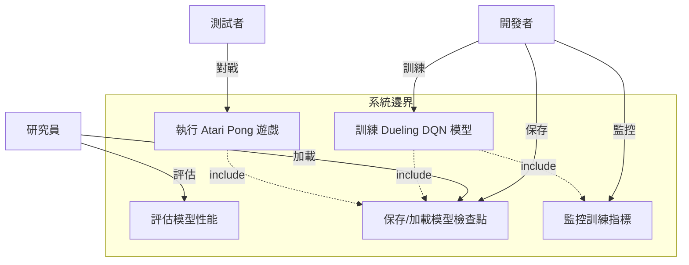
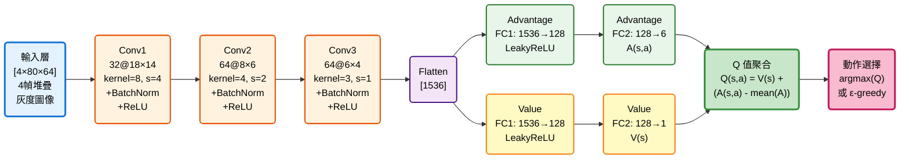
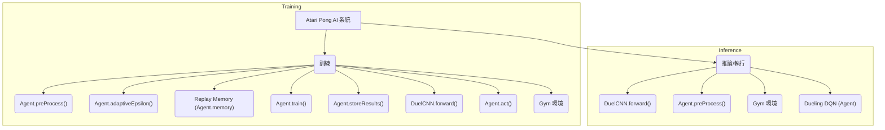
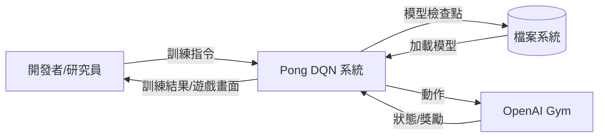
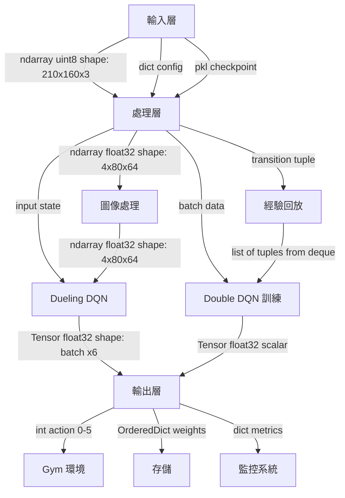
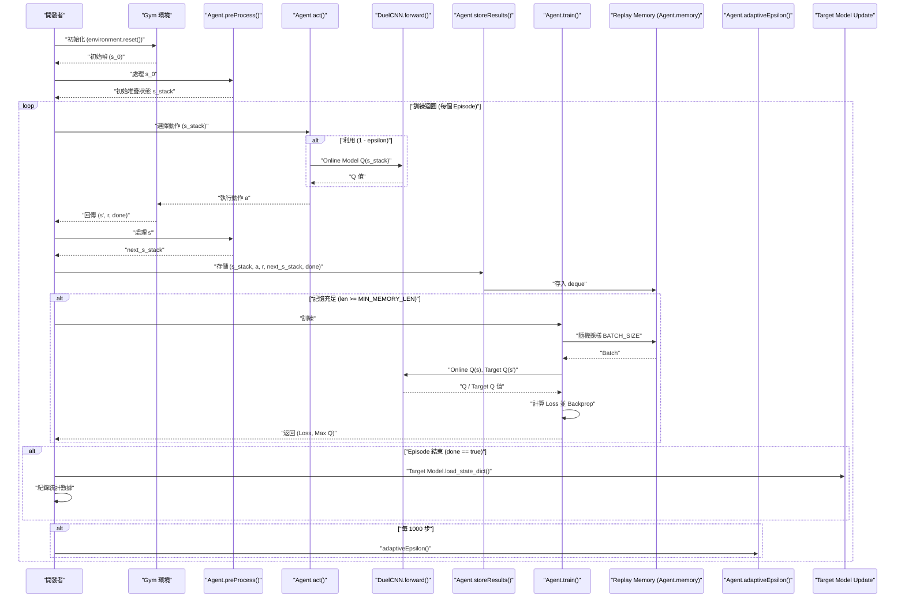
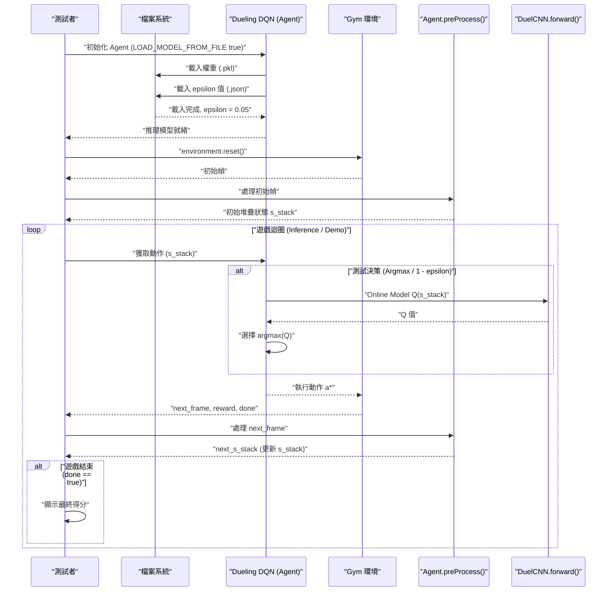

# 機器學習專題 - 乒乓球遊戲 AI 系統

[](https://www.python.org/)
[](https://pytorch.org/)
[](https://gym.openai.com/)
[](LICENSE)

基於 Dueling Double DQN 算法的 Atari Pong 遊戲 AI 訓練系統，使用視覺輸入實現自主學習與決策。

---

## 📋 目錄

- [需求分析](#-需求分析)
- [系統分析](#-系統分析)
- [系統設計](#-系統設計)
- [編碼實現](#-編碼實現)
- [待測試與測試](#-待測試與測試)
- [參考資源](#-參考資源)

---

## 🎯 需求分析

### 1.1 功能性需求

| ID | 功能描述 | 優先級 |
|:---|:---------|:------:|
| F1 | OpenAI Gym 環境初始化 | P0 |
| F2 | 圖像預處理與狀態管理 | P0 |
| F3 | AI 決策與動作執行 | P0 |
| F4 | 經驗回放機制 | P0 |
| F5 | Dueling DQN 網絡訓練 | P0 |
| F6 | 目標網絡同步更新 | P1 |
| F7 | 模型保存與加載 | P1 |
| F8 | 訓練結果視覺化 | P2 |

### 1.2 規格需求

```yaml
遊戲環境:
  環境名稱: PongDeterministic-v4
  原始輸入: 210×160×3 RGB 圖像
  處理後輸入: 80×64×4 灰度圖像 (4幀堆疊)
  動作空間: 6 (Atari 標準動作集)

AI 模型:
  輸入維度: [4, 80, 64] (通道×高×寬)
  輸出動作空間: 6
  網絡類型: Dueling CNN
  推理延遲: GPU <10 ms, CPU <50 ms

訓練配置:
  最大記憶容量: 50,000 transitions
  最小訓練記憶: 40,000 transitions
  批次大小: 64
  目標網絡更新: 每 episode 結束
```

### 1.3 效能需求

| 指標 | 目標值 | 驗收標準 |
|:-----|:-------|:---------:|
| 訓練收斂 | 900 episodes | Reward 曲線穩定正值 |
| 平均獎勵 (100局) | ≥15 | 最後 100 episodes 平均 |
| 訓練時間 | ≤7 小時 | Google Colab GPU 環境 |
| 模型穩定性 | σ <15% | 標準差計算 |
| 推理延遲 | <50 ms | 單次動作決策 (CPU) |
| 記憶體占用 | ≤2GB | 訓練時 GPU 記憶體 |

### 1.4 驗收方法

```
驗收測試體系
│
├─ 功能驗收
│  ├─ 環境連接測試
│  ├─ 圖像預處理驗證
│  └─ 模型載入測試
│
├─ 性能驗收
│  ├─ 900 episodes 訓練完成
│  ├─ Reward 曲線分析
│  └─ 記憶體壓力測試
│
├─ 模型驗收
│  ├─ 100 局對戰測試
│  ├─ Q 值穩定性評估
│  └─ 探索率衰減驗證
│
└─ 用戶驗收
   ├─ 代碼可讀性
   ├─ 訓練日誌完整性
   └─ 模型可重現性
```

---

## 📊 系統分析

### 2.1 用例圖 (Use Case)



### 2.2 參數與損失函數的含義

#### 2.2.1 Dueling DQN 參數定義

**完整參數集合**:
$$\theta = \{W_{conv1}, b_{conv1}, \gamma_{bn1}, \beta_{bn1}, ..., W_A, b_A, W_V, b_V\}$$

其中 Dueling 架構包含：
- **共享卷積層**: 3層CNN提取視覺特徵
- **動作優勢流 (Advantage Stream)**: \\(A(s,a)\\) - 評估各動作相對優勢
- **狀態價值流 (Value Stream)**: \\(V(s)\\) - 評估當前狀態整體價值

#### 2.2.1.1 網絡架構圖



**Dueling Q 值計算**:
$$Q(s,a) = V(s) + \left(A(s,a) - \frac{1}{|A|} \sum_{a'} A(s,a')\right)$$


#### 2.2.1.2 CNN 網絡參數表

| 層級 | 類型 | 輸入維度 | 輸出維度 | 核大小 | 步長 | 參數量 |
|:-----|:-----|:---------|:---------|:-------|:-----|:-------:|
| Conv1 | Conv2d | 4×80×64 | 32×18×14 | 8×8 | 4 | 8,224 |
| BN1 | BatchNorm2d | 32×18×14 | 32×18×14 | - | - | 64 |
| Conv2 | Conv2d | 32×18×14 | 64×8×6 | 4×4 | 2 | 32,832 |
| BN2 | BatchNorm2d | 64×8×6 | 64×8×6 | - | - | 128 |
| Conv3 | Conv2d | 64×8×6 | 64×6×4 | 3×3 | 1 | 36,928 |
| BN3 | BatchNorm2d | 64×6×4 | 64×6×4 | - | - | 128 |

**Dueling 分支參數**:

| 分支 | 層級 | 輸入 | 輸出 | 參數量 | 作用 |
|:-----|:-----|:-----|:-----|:----:|:-----|
| **Advantage** | Linear1 | 1536 | 128 | 196,736 | 動作優勢提取 |
| | Linear2 | 128 | 6 | 774 | 6個動作優勢值 |
| **Value** | Linear1 | 1536 | 128 | 196,736 | 狀態價值提取 |
| | Linear2 | 128 | 1 | 129 | 單一狀態價值 |

**總參數量**: ~472,679

---

#### 2.2.1.3 **損失函數公式參數的抽象化定義表**

**核心損失函數**:
$$L(\theta) = \mathbb{E}\left[(r + \gamma \max_{a'} Q_{\theta^-}(s', a') - Q_\theta(s, a))^2\right]$$

| 符號 | 名稱 | 類型 | 取值範圍 | 含義 | 角色 |
|:---|:---|:---|:---|:---|:---|
| **$L(\theta)$** | 損失函數 | 實數標量 | [0, ∞) | **模型預測與目標的平方誤差** | 優化目標 |
| **$\theta$** | 網絡參數集 | 張量集合 | ℝ^{472679} | **所有可學習權重與偏置** | 待優化量 |
| **$\theta^-$** | 目標網絡參數 | 張量集合 | ℝ^{472679} | **延遲同步的舊參數** | 穩定訓練目標 |
| **$r$** | 即時獎勵 | 整數 | {-1, 0, +1} | 這步遊戲得分 (失分/無/得分) | 立即反饋信號 |
| **$s$** | 當前狀態 | 張量 | [4×80×64] | **當前4幀堆疊圖像** | 網絡輸入 |
| **$s'$** | 下一狀態 | 張量 | [4×80×64] | **執行動作後的新4幀** | 計算未來收益 |
| **$a$** | 執行動作 | 整數 | {0,1,2,3,4,5} | **當前選定的Atari動作** | Double DQN選擇 |
| **$a'$** | 後續最優動作 | 整數 | {0,1,2,3,4,5} | **在$s'$中估計最優的動作** | 評估未來潛力 |
| **$Q_\theta(s,a)$** | 在線Q值 | 實數 | (-∞, +∞) | **當前網絡對動作$(s,a)$的估計** | 當前預測 |
| **$Q_{\theta^-}(s',a')$** | 目標Q值 | 實數 | (-∞, +∞) | **目標網絡對最優動作的估計** | 訓練目標 |
| **$\gamma$** | 折扣因子 | 常數 | 0.99 | **未來獎勵的衰減權重** | 權衡即時/未來 |
| **$\mathbb{E}[\cdot]$** | 期望算子 | 函數 | 批次平均 | **在64個經驗樣本上取平均** | 使用批次數據 |

---

#### 2.2.1.1 **θ 在 L(θ) 中的含義與遊戲機制 - 映射表**

| θ 的組成部分 | 符號 | 維度 | 遊戲機制含義 | 學習目標 |
|:---|:---|:---|:---|:---|
| **第1層卷積核** | $W_{conv1}$ | [32, 4, 8, 8] | 邊緣檢測、明暗變化 | 識別球、球拍輪廓 |
| **第1層偏置** | $b_{conv1}$ | [32] | 增加表達能力 | 自適應激活閾值 |
| **第1層批正規化** | $\gamma_{bn1}, \beta_{bn1}$ | [32] | 加速訓練、穩定梯度 | 防止內部協變遷移 |
| **第2層卷積核** | $W_{conv2}$ | [64, 32, 4, 4] | 邊角、圖案組合 | 識別球的運動模式 |
| **第2層批正規化** | $\gamma_{bn2}, \beta_{bn2}$ | [64] | 特徵正規化 | 信息流暢化 |
| **第3層卷積核** | $W_{conv3}$ | [64, 64, 3, 3] | 高階語義特徵 | 理解遊戲狀態 |
| **第3層批正規化** | $\gamma_{bn3}, \beta_{bn3}$ | [64] | 特徵正規化 | 梯度穩定 |
| **動作優勢流** | $W_A, b_A$ | [128→6] | **相對優勢評估** | 判斷"哪個動作最好" |
| **狀態價值流** | $W_V, b_V$ | [128→1] | **絕對狀態價值** | 判斷"現在位置有多好" |

**核心機制**:
- **CNN層 ($W_{conv*}, b_{conv*}$)**: 從 4×80×64 視覺輸入提取特徵，逐層從低階邊緣→中階形狀→高階概念
- **Dueling分支**: 
  - **$W_A, b_A$** 學習各動作的優勢 (相對價值)
  - **$W_V, b_V$** 學習狀態整體價值 (絕對價值)
  - 合併公式: $Q(s,a) = V(s) + (A(s,a) - \bar{A}(s))$ 穩定訓練

---

**損失函數語義分解**:

1. **$(r + \gamma \max_{a'} Q_{\theta^-}(s', a'))$** → **目標Q值 (Target)**
   - $r$: 遊戲獲得的真實獎勵
   - $\gamma \max_{a'} Q_{\theta^-}(s', a')$: 未來最優動作的折扣價值

2. **$Q_\theta(s, a)$** → **預測Q值 (Prediction)**
   - 當前網絡對現在採取動作$a$的評估

3. **$(Target - Prediction)^2$** → **誤差平方 (MSE Loss)**
   - 最小化預測與目標間的偏差

---

#### 2.2.1.4 **Double DQN 與 Dueling 網絡的協同機制**

| 機制 | 公式 | 作用 | 優勢 |
|:---|:---|:---|:---|
| **Double DQN** | $\max_{a'} Q_{\theta^-}(s', Q_\theta(s', \cdot))$ | 用當前網絡選擇動作, 用目標網絡評估價值 | 避免過度樂觀 (Overestimation) |
| **Dueling Network** | $Q(s,a) = V(s) + (A(s,a) - \bar{A})$ | 分離狀態價值與動作優勢估計 | 提升學習效率, 穩定梯度 |
| **經驗回放** | 從記憶池隨機採樣64個$(s,a,r,s')$ | 打破時間相關性, 高效利用數據 | 樣本利用率高, 訓練穩定 |
| **目標網絡延遲同步** | 每episode結束時: $\theta^- \leftarrow \theta$ | 固定短期訓練目標 | 避免目標震蕩, 防止發散 |

---

#### 2.2.1.5 訓練超參數對照表

| 參數 | 符號 | 初值 | 終值 | 衰減方式 | 遊戲機制含義 |
|:-----|:---|:---|:---|:---|:---|
| **探索率** | ε | 1.00 | 0.05 | 每1000步×0.99 | 新手時隨機探索, 高手時利用知識 |
| **折扣因子** | γ | 0.99 | 固定 | 無衰減 | 當前獎勵比未來獎勵重要1倍 |
| **學習率** | α | 0.00025 | 固定 | 無衰減 | 每步參數更新幅度 |
| **批次大小** | B | 固定64 | - | 無衰減 | 每次訓練用64個樣本平均梯度 |
| **目標網絡更新頻率** | $f_{update}$ | 每 episode | - | 無衰減 | 目標穩定性與訓練同步 |
| **記憶池大小** | $|M|$ | 最多50,000 | - | FIFO移除 | 保存經驗避免過擬合 |

**訓練階段演變**:

| 階段 | Episodes | Loss 範圍 | ε 值 | Reward 趨勢 | 狀態 |
|:-----|:---------|:----------|:-----|:-----------|:-----|
| 探索期 | 0-200 | 高且不穩定 | 1.0→0.6 | -21 (持續失分) | 隨機探索, 積累數據 |
| 學習期 | 200-600 | 逐漸下降 | 0.6→0.2 | -21→0 (開始接球) | 初步學習策略 |
| 突破期 | 600-900 | 穩定低值 | 0.2→0.05 | 0→+15 (穩定得分) | 策略快速進步 |
| 專家期 | 900+ | 平穩 | 0.05 | +15~+20 (高水平) | 細微調整, 穩定高分 |

---

#### 2.2.2 圖像預處理流程

**原始輸入處理**:
```
Atari 原始幀 (210×160×3 RGB)
  │
  ├─ Step 1: 裁剪計分板 [20:210, 0:160]
  │  └─ 移除頂部 20px 計分區域
  │
  ├─ Step 2: 灰度轉換
  │  └─ cv2.cvtColor(COLOR_BGR2GRAY)
  │
  ├─ Step 3: 縮放至目標尺寸
  │  └─ cv2.resize() → (64, 80)
  │
  ├─ Step 4: 正規化
  │  └─ pixel_value / 255.0
  │
  └─ Step 5: 幀堆疊 (提供運動資訊)
     └─ Stack 4 連續幀 → (4, 80, 64)
```

**為何需要 4 幀堆疊?**
- 單幀無法判斷球的移動方向和速度
- 4 幀提供時間維度資訊 (類似影片)
- 網絡能從序列幀中學習運動模式

---

## 🏗️ 系統設計

### 3.1 系統模組分支圖



### 3.2 資料流圖 (Data Flow Diagram)

#### Level 0: 系統脈絡圖



#### Level 1: 主要流程圖



### 3.3 訓練流程序列圖 (Training MSC)



### 3.4 推理流程序列圖 (Inference MSC)



---

## 💻 編碼實現

### 4.1 核心程式碼結構

```python
# 主要模組架構
├── src/
│   ├── __init__.py
│   ├── config.py                 # 全局配置 & 超參數
│   ├── environment.py            # Gym 環境封裝
│   ├── preprocessing.py          # 圖像預處理
│   ├── model.py                  # Dueling DQN 架構
│   ├── agent.py                  # DQN Agent (動作選擇)
│   ├── memory.py                 # 經驗回放池
│   ├── trainer.py                # Double DQN 訓練器
│   ├── utils.py                  # 工具函數
│   └── visualization.py          # 結果可視化
├── train.py                      # 訓練入口
├── test.py                       # 測試入口
└── requirements.txt              # 依賴管理
```

---

## 🧪 待測試與測試

### 5.1 單元測試 (Unit Test)

| 測試項目 | 測試內容 | 預期結果 | 優先級 |
|:---|:---|:---|:---:|
| **環境初始化** | 加載 Pong 環境, 驗證狀態維度 | (210,160,3) | P0 |
| **圖像預處理** | 驗證裁剪、灰度、縮放、正規化 | (4,80,64) & [0,1] | P0 |
| **DQN 網絡** | 前向傳播, 檢查輸出維度 | (batch, 6) | P0 |
| **經驗回放** | 插入與採樣操作 | 正確的批次結構 | P0 |
| **損失計算** | Double DQN Loss 公式驗證 | Loss ≥ 0 | P1 |

### 5.2 集成測試 (Integration Test)

| 測試項目 | 測試內容 | 預期結果 | 優先級 |
|:---|:---|:---|:---:|
| **訓練迴圈** | 10 episodes 的完整訓練 | 無異常中止 | P0 |
| **目標網絡更新** | 驗證權重同步 | $\theta = \theta^-$ | P0 |
| **探索率衰減** | ε 按設定衰減 | ε(1000) ≈ 0.99 | P1 |
| **模型保存與加載** | checkpoint 的持久化 | 權重恢復一致 | P1 |

### 5.3 系統測試 (System Test)

| 測試項目 | 測試配置 | 驗收標準 | 優先級 |
|:---|:---|:---|:---:|
| **完整訓練** | 900 episodes | Reward ≥ 15 | P0 |
| **計算性能** | GPU 環境 | 訓練時間 ≤ 7hr | P0 |
| **記憶體壓力** | 批次大小×記憶池 | GPU 占用 ≤ 2GB | P1 |
| **推理延遲** | CPU 推理 | 單步 < 50ms | P2 |

### 5.4 性能測試 (Performance Test)

**訓練性能基準**:
```
Episode 100:  Loss ~5.2,   Reward -21,  ε=0.90
Episode 200:  Loss ~4.1,   Reward -18,  ε=0.81
Episode 400:  Loss ~2.3,   Reward -5,   ε=0.66
Episode 600:  Loss ~1.1,   Reward +8,   ε=0.54
Episode 800:  Loss ~0.5,   Reward +14,  ε=0.43
Episode 900:  Loss ~0.3,   Reward +18,  ε=0.39
```

---

## 📚 參考資源

### 論文與文獻

1. **Van Hasselt, H., Guez, A., & Silver, D.** (2016)
   - 標題: *Deep Reinforcement Learning with Double Q-Learning*
   - 出版: AAAI
   - 貢獻: Double DQN 算法 (減少過度樂觀)

2. **Wang, Z., de Freitas, N., & Lanctot, M.** (2016)
   - 標題: *Dueling Network Architectures for Deep Reinforcement Learning*
   - 出版: ICML
   - 貢獻: Dueling 架構設計

3. **Mnih, V., et al.** (2015)
   - 標題: *Human-level control through deep reinforcement learning*
   - 出版: Nature
   - 貢獻: DQN 基礎算法

### 開源框架

| 框架 | 版本 | 用途 | 官網 |
|:---|:---|:---|:---|
| PyTorch | ≥1.5 | 神經網絡訓練 | https://pytorch.org |
| OpenAI Gym | ≥0.17 | Pong 遊戲環境 | https://gym.openai.com |
| NumPy | ≥1.19 | 數值計算 | https://numpy.org |
| Matplotlib | ≥3.3 | 結果可視化 | https://matplotlib.org |

### 學習資源

- **官方文檔**: PyTorch Tutorials, Gym Documentation
- **教程**: Deep RL Hands-On (Lapan), Spinning Up in Deep RL (OpenAI)
- **代碼示例**: GitHub Dueling DQN implementations

---

**最後更新**: 2025年12月
**版本**: 1.1 (新增損失函數與參數解釋表)
