# 機器學習專題 - 乒乓球遊戲 AI 系統

[](https://www.python.org/)
[](https://pytorch.org/)
[](LICENSE)

基於 Deep Q-Network (DQN) 的乒乓球遊戲 AI 訓練系統,實現自主學習與決策。

---

## 📋 目錄

- [需求分析](#-需求分析)
- [系統分析](#-系統分析)
- [系統設計](#-系統設計)
- [編碼實現](#-編碼實現)
- [待測試與測試](#-待測試與測試)
- [參考資源](#-參考資源)

---

## 🎯 需求分析

### 1.1 功能性需求

| ID | 功能描述 | 優先級 |
|:---|:---------|:------:|
| F1 | 遊戲環境建立與初始化 | P0 |
| F2 | 球物理運動模擬 | P0 |
| F3 | 球拍控制與移動 | P0 |
| F4 | AI 決策與動作執行 | P0 |
| F5 | 遊戲狀態跟蹤與得分計算 | P1 |
| F6 | 訓練/預測模式切換 | P1 |
| F7 | 模型保存與加載 | P1 |
| F8 | 視覺化結果呈現 | P2 |

### 1.2 規格需求

```yaml
遊戲引擎:
  幀率: 60 FPS
  球速度範圍: 5~15 px/frame
  球拍反應時間: ≤50 ms

AI 模型:
  輸入狀態維度: 5 [ball_x, ball_y, vx, vy, paddle_x]
  輸出動作空間: 3 [左移, 不動, 右移]
  推理延遲: <30 ms/action

訓練配置:
  訓練收斂時間: ≤2小時 (1000 episodes)
  記憶體需求: ≤2 GB
  收斂標準: 500 episodes
```

### 1.3 效能需求

| 指標 | 目標值 | 驗收標準 |
|:-----|:-------|:---------|
| 接球成功率 | ≥85% | 連續 100 局測試 |
| 平均遊戲時長 | ≥100 球 | 單局統計 |
| 模型穩定性 | σ <10% | 標準差計算 |
| 推理延遲 | <30 ms | 單次動作決策 |
| 訓練收斂 | 500 episodes | Loss 曲線穩定 |

### 1.4 驗收方法

```
驗收測試體系
│
├─ 功能驗收
│  ├─ 單元測試
│  ├─ 集成測試
│  └─ 功能檢查表
│
├─ 性能驗收
│  ├─ 基準測試
│  ├─ 壓力測試
│  └─ 記憶體測試
│
├─ 模型驗收
│  ├─ 準確度評估
│  ├─ 泛化性測試
│  └─ 穩定性測試
│
└─ 用戶驗收
   ├─ 文件完整性
   ├─ 視覺化結果
   └─ 代碼可讀性
```

---

## 📊 系統分析

### 2.1 用例圖 (Use Case)

```mermaid
graph TB
    subgraph 系統邊界
        UC1[訓練 AI 模型]
        UC2[執行對戰遊戲]
        UC3[評估模型性能]
        UC4[保存/加載模型]
        UC5[監控訓練進度]
    end

    Developer[開發者] -->|訓練| UC1
    Developer -->|保存| UC4
    Developer -->|監控| UC5

    Player[玩家] -->|對戰| UC2

    Researcher[研究員] -->|評估| UC3
    Researcher -->|加載| UC4

    UC1 -.->|include| UC4
    UC1 -.->|include| UC5
    UC2 -.->|include| UC4
```

### 2.2 參數與損失函數的含義

#### 2.2.1 參數 θ 的定義與意義

DQN 神經網絡的所有可學習參數:

**參數集合**:
$\theta = \{W_1, b_1, W_2, b_2, W_3, b_3, W_{out}, b_{out}\}$

**參數更新規則**:
$\theta_{new} = \theta_{old} - \alpha \cdot \nabla_\theta L(\theta)$

#### 2.2.1.1 DQN 參數抽象化定義表

| 符號 | 參數名稱 | 維度 | 抽象定義 | 物理意義 | 初始化方式 |
|:-----|:---------|:-----|:---------|:---------|:----------|
| **W₁** | 第1層權重矩陣 | 5×64 | 特徵提取器 | 將原始狀態向量映射到64維隱空間 | Xavier均勻 |
| **b₁** | 第1層偏置向量 | 64 | 平移項 | 調整第1層激活的基準點 | 全零初始化 |
| **W₂** | 第2層權重矩陣 | 64×64 | 特徵融合器 | 在隱空間中進行64維線性變換 | Xavier均勻 |
| **b₂** | 第2層偏置向量 | 64 | 平移項 | 調整第2層激活的基準點 | 全零初始化 |
| **W₃** | 第3層權重矩陣 | 64×32 | 特徵壓縮器 | 將64維特徵壓縮到32維 | Xavier均勻 |
| **b₃** | 第3層偏置向量 | 32 | 平移項 | 調整第3層激活的基準點 | 全零初始化 |
| **W_{out}** | 輸出層權重矩陣 | 32×3 | Q值映射器 | 將32維特徵映射到3個Q值 | Xavier均勻 |
| **b_{out}** | 輸出層偏置向量 | 3 | 平移項 | 調整Q值的基準線 | 全零初始化 |

#### 2.2.1.2 梯度與優化參數表

| 符號 | 參數名稱 | 取值範圍 | 抽象定義 | 影響效果 |
|:-----|:---------|:----------|:---------|:---------|
| **α** | 學習率 | 0.00025 | 參數更新的步長控制因子 | 過大→不穩定；過小→收斂慢 |
| **∇θL(θ)** | 梯度向量 | ℝⁿ | 損失函數在參數空間的方向導數 | 指向損失減小方向 |
| **γ** | 折扣因子 | 0.99 | 未來獎勵的衰減係數 | γ大→遠視；γ小→近視 |
| **ε** | 探索率 | [0.05, 1.0] | 隨機探索動作的概率 | ε大→探索多；ε小→利用多 |
| **τ** | 目標網絡更新率 | 0.001 | 軟更新時的混合係數 | 控制穩定性與適應速度 |

#### 2.2.1.3 動作與狀態空間參數表

| 符號 | 參數名稱 | 維度 | 抽象定義 | 具體內容 |
|:-----|:---------|:-----|:---------|:---------|
| **S** | 狀態向量 | 5 | 遊戲環境的完整觀察 | [ball_x, ball_y, vel_x, vel_y, paddle_x] |
| **A** | 動作空間 | 3 | 智能體可執行的動作集合 | {0:左移, 1:不動, 2:右移} |
| **R** | 獎勵值 | 1 | 執行動作後環境的即時反饋 | {-1:失分, 0:無, +1:得分} |
| **Q(s,a)** | Q值函數 | 1 | 在狀態s執行動作a的期望累積獎勵 | θ參數化的神經網絡輸出 |
| **V(s)** | 狀態價值函數 | 1 | 在狀態s的最優長期獎勵期望 | max_a Q(s,a) |

#### 2.2.1.4 訓練超參數表

| 參數名 | 符號 | 預設值 | 範圍 | 作用域 | 調整建議 |
|:-------|:-----|:--------|:-----|:--------|:---------|
| 學習率 | α | 0.001 | [0.0001, 0.1] | 權重更新速度 | 訓練不穩定→降低 |
| 折扣因子 | γ | 0.99 | [0.9, 0.999] | 長期獎勵權重 | 短期策略→降低 |
| 批次大小 | B | 64 | [32, 256] | 梯度估計 | 記憶體不足→降低 |
| 緩衝容量 | M | 10000 | [1000, 100000] | 經驗回放 | 訓練不穩定→增加 |
| ε初始值 | ε₀ | 1.0 | [0.8, 1.0] | 初始探索 | 固定 |
| ε最小值 | ε_min | 0.05 | [0.01, 0.1] | 最低探索率 | 取決於環境 |
| ε衰減率 | ε_decay | 0.995 | [0.99, 0.9999] | 探索衰減速度 | 衰減太快→提高 |
| 更新頻率 | τ_freq | 10 | [5, 100] | 目標網絡同步 | 訓練震蕩→增加 |

其中:
- **α (學習率)**: 0.001 - 控制每次更新的步長大小
- **∇θL(θ)**: 損失函數對參數的梯度 - 指示參數更新的方向

#### 2.2.2 損失函數 L(θ) 的結構與演進

**DQN 損失函數**:
$$L(\theta) = \mathbb{E}\left[(Q_{target}(S,A) - Q_\theta(S,A))^2\right]$$

其中目標 Q 值計算:
$$Q_{target} = r + \gamma \cdot \max_{a'} Q_{\theta^-}(S', a')$$

**訓練階段演變**:

| 階段 | Episodes | Loss 範圍 | ε 值 | 特徵 |
|:-----|:---------|:----------|:-----|:-----|
| 初始化 | 0-100 | 高且不穩定 | 1.0→0.8 | 隨機探索為主 |
| 學習期 | 100-500 | 逐漸下降 | 0.8→0.3 | 開始學習有效策略 |
| 收斂期 | 500-1000 | 穩定低值 | 0.3→0.05 | 策略優化 |
| 穩定期 | 1000+ | 平穩 | 0.05 | 高度利用學習結果 |

#### 2.2.3 θ 在遊戲決策中的具體機制

**狀態 → Q 值轉換過程**:

```
輸入狀態
  │
  ├─ ball_x (球的 X 座標)
  ├─ ball_y (球的 Y 座標)
  ├─ vx (球的 X 方向速度)
  ├─ vy (球的 Y 方向速度)
  └─ paddle_x (球拍的 X 座標)
  │
  ├─ 第一層權重 W1, b1 (5→64)
  │  └─ 原始狀態特徵提取
  │
  ├─ 第二層權重 W2, b2 (64→64)
  │  └─ 中層特徵組合與融合
  │
  ├─ 第三層權重 W3, b3 (64→32)
  │  └─ 高層抽象表示
  │
  └─ 輸出層權重 Wout, bout (32→3)
     └─ 動作價值映射
        │
        ├─ Q (左移)
        ├─ Q (不動)
        └─ Q (右移)
        │
        └─ argmax(Q) → 選擇動作
```

---

## 🏗️ 系統設計

### 3.1 系統模組分支圖



### 3.2 資料流圖 (Data Flow Diagram)

#### Level 0: 系統脈絡圖



#### Level 1: 主要流程圖



### 3.3 訓練流程序列圖 (Training MSC)



### 3.4 推理流程序列圖 (Inference MSC)



### 3.5 技術選型

| 層級 | 技術 | 版本 | 用途 |
|:-----|:-----|:-----|:-----|
| **遊戲引擎** | Pygame / 自建 | 2.5+ | 物理模擬與渲染 |
| **ML 框架** | PyTorch | 2.0+ | 神經網絡建構與訓練 |
| **RL 算法** | Deep Q-Network | - | 強化學習核心算法 |
| **優化器** | Adam | - | 參數更新 |
| **GPU 加速** | CUDA | 11.8+ | 訓練加速 (NVIDIA) |
| **程式語言** | Python | 3.8+ | 主要開發語言 |
| **數據處理** | NumPy | 1.24+ | 陣列運算 |
| **視覺化** | Matplotlib | 3.7+ | 訓練曲線繪製 |

### 3.6 DQN 神經網絡結構 (完整版)

#### 3.6.1 網絡架構圖

```
┌─────────────────────────────────────────────────────────────────┐
│                    DQN 神經網絡架構                              │
└─────────────────────────────────────────────────────────────────┘

          輸入層                  隱藏層 1              隱藏層 2
        (5個神經元)            (64個神經元)         (64個神經元)
        
        ●────────────┐                               
        │   ball_x   │         ┌──────┬──────┐        
        │   ball_y   │─────────┤  H1  │ ReLU├─────┐   
        │   vel_x    │         └──────┴──────┘     │    
        │   vel_y    │                          ┌──┴────┐
        │  paddle_x  │                          │  H2   │
        ●────────────┘                    ┌─────┤ ReLU  ├─────┐
                                          │     └───────┘     │


          隱藏層 3              輸出層 (Q-值)
        (32個神經元)          (3個動作)
        
        ┌──────┬──────┐          
        │  H3  │ ReLU ├──────┬────────────────────┐
        └──────┴──────┘      │                    │
                          ┌──▼──┐              ┌──▼──┐
                          │ Q1  │  Q(左移)     │ Q2  │
                          └─────┘              └─────┘
                                            ┌──────┐
                                            │ Q3   │ Q(右移)
                                            └──────┘
                                         
                          ┌──────────────┐
                          │ argmax(Q)    │
                          │ 選擇最佳動作 │
                          └──────────────┘
```

#### 3.6.2 參數詳細計算表

| 層級 | 層類型 | 輸入維度 | 輸出維度 | 權重數 | 偏置數 | 總參數數 | 激活函數 |
|:-----|:-------|:----------|:----------|:--------|:--------|:-----------|:----------|
| Input | - | 5 | 5 | - | - | - | - |
| Layer 1 | Linear | 5 | 64 | 320 | 64 | **384** | ReLU |
| Layer 2 | Linear | 64 | 64 | 4,096 | 64 | **4,160** | ReLU |
| Layer 3 | Linear | 64 | 32 | 2,048 | 32 | **2,080** | ReLU |
| Output | Linear | 32 | 3 | 96 | 3 | **99** | Linear |
| | | | | | **總計** | **6,723** | |

#### 3.6.3 前向傳播公式

**第1層**: 
$$z_1 = W_1 \cdot x + b_1$$
$$a_1 = \text{ReLU}(z_1) = \max(0, z_1)$$

**第2層**: 
$$z_2 = W_2 \cdot a_1 + b_2$$
$$a_2 = \text{ReLU}(z_2)$$

**第3層**: 
$$z_3 = W_3 \cdot a_2 + b_3$$
$$a_3 = \text{ReLU}(z_3)$$

**輸出層**: 
$$Q_{values} = W_{out} \cdot a_3 + b_{out}$$

#### 3.6.4 網絡初始化策略

```python
# 權重初始化: Xavier 均勻分佈
W ~ Uniform[-√(6/(n_in + n_out)), √(6/(n_in + n_out))]

# 偏置初始化: 全零
b = 0

# Layer 1: W1 ~ Uniform[-√(6/69), √(6/69)]   # (5+64)
# Layer 2: W2 ~ Uniform[-√(6/128), √(6/128)] # (64+64)
# Layer 3: W3 ~ Uniform[-√(6/96), √(6/96)]   # (64+32)
# Output:  Wout ~ Uniform[-√(6/35), √(6/35)] # (32+3)
```

---

## 💻 編碼實現

### 4.1 核心代碼結構

```
pong_ai/
├── main.py                 # 主程式入口
├── game/
│   ├── __init__.py
│   ├── engine.py          # 遊戲引擎
│   ├── physics.py         # 物理模擬
│   └── renderer.py        # 視覺化渲染
├── agent/
│   ├── __init__.py
│   ├── dqn_model.py       # DQN 網絡定義
│   ├── agent.py           # Agent 邏輯
│   └── replay_buffer.py   # 經驗回放緩衝
├── training/
│   ├── __init__.py
│   ├── trainer.py         # 訓練主迴圈
│   └── evaluator.py       # 模型評估
├── utils/
│   ├── __init__.py
│   ├── logger.py          # 日誌記錄
│   └── plotter.py         # 結果繪圖
└── config.py              # 配置參數
```

### 4.2 關鍵實現細節

#### DQN 模型定義

```python
import torch
import torch.nn as nn

class DQN(nn.Module):
    def __init__(self, state_dim=5, action_dim=3):
        super(DQN, self).__init__()
        self.fc1 = nn.Linear(state_dim, 64)
        self.fc2 = nn.Linear(64, 64)
        self.fc3 = nn.Linear(64, 32)
        self.out = nn.Linear(32, action_dim)

    def forward(self, x):
        x = torch.relu(self.fc1(x))
        x = torch.relu(self.fc2(x))
        x = torch.relu(self.fc3(x))
        return self.out(x)  # Linear output
```

#### Agent 決策邏輯

```python
class Agent:
    def __init__(self, state_dim, action_dim):
        self.epsilon = 1.0
        self.epsilon_decay = 0.995
        self.epsilon_min = 0.05
        self.q_network = DQN(state_dim, action_dim)
        self.target_network = DQN(state_dim, action_dim)
        self.optimizer = torch.optim.Adam(self.q_network.parameters(), lr=0.001)

    def select_action(self, state):
        if np.random.rand() < self.epsilon:
            return np.random.randint(0, 3)  # Explore
        else:
            with torch.no_grad():
                q_values = self.q_network(torch.FloatTensor(state))
                return torch.argmax(q_values).item()  # Exploit

    def update_epsilon(self):
        self.epsilon = max(self.epsilon_min, self.epsilon * self.epsilon_decay)
```

#### 訓練迴圈

```python
def train_episode(env, agent, replay_buffer):
    state = env.reset()
    total_reward = 0
    done = False

    while not done:
        action = agent.select_action(state)
        next_state, reward, done, _ = env.step(action)

        replay_buffer.push(state, action, reward, next_state, done)

        if len(replay_buffer) > BATCH_SIZE:
            batch = replay_buffer.sample(BATCH_SIZE)
            loss = agent.train_step(batch)

        state = next_state
        total_reward += reward

    agent.update_epsilon()
    return total_reward
```

### 4.3 配置參數 (config.py)

```python
# 遊戲參數
SCREEN_WIDTH = 800
SCREEN_HEIGHT = 600
FPS = 60
BALL_SPEED_RANGE = (5, 15)
PADDLE_SPEED = 10

# DQN 參數
STATE_DIM = 5
ACTION_DIM = 3
HIDDEN_DIMS = [64, 64, 32]

# 訓練參數
LEARNING_RATE = 0.001
GAMMA = 0.99
EPSILON_START = 1.0
EPSILON_END = 0.05
EPSILON_DECAY = 0.995
BATCH_SIZE = 64
MEMORY_SIZE = 10000
TARGET_UPDATE_FREQ = 10

# 訓練設置
MAX_EPISODES = 1000
MAX_STEPS_PER_EPISODE = 1000
SAVE_INTERVAL = 50
```

---

## ✅ 待測試與測試

### 5.1 測試計劃



### 5.2 模型評估指標

#### 訓練過程監控

```python
# 關鍵指標
metrics = {
    'episode_reward': [],      # 每局獎勵
    'moving_avg_reward': [],   # 移動平均獎勵 (100 episodes)
    'loss': [],                # MSE Loss
    'epsilon': [],             # 探索率
    'avg_q_value': [],         # 平均 Q 值
    'episode_length': []       # 每局步數
}
```

**評估公式**:

1. **移動平均獎勵**: 
$$R_{avg}(t) = \frac{1}{100}\sum_{i=t-99}^{t} R_i$$

2. **損失函數**: 
$$L(\theta) = \frac{1}{N}\sum_{i=1}^{N} (y_i - Q_\theta(s_i, a_i))^2$$

3. **探索率衰減**: 
$$\epsilon_t = \max(\epsilon_{min}, \epsilon_{start} \cdot \gamma_{\epsilon}^t)$$

4. **Q 值估計**: 
$$\bar{Q}(t) = \frac{1}{|B|}\sum_{(s,a) \in B} Q_\theta(s,a)$$

### 5.3 性能基準測試結果

| 指標 | 目標值 | 實測值 | 達成率 | 狀態 |
|:-----|:-------|:-------|:-------|:-----|
| 接球成功率 | ≥85% | **待測試** | - | ⏳ 待測試 |
| 平均遊戲時長 | ≥100 球 | **待測試** | - | ⏳ 待測試 |
| 推理延遲 | <30ms | **待測試** | - | ⏳ 待測試 |
| 訓練時間 | ≤2小時 | **待測試** | - | ⏳ 待測試 |
| 穩定性 σ | <10% | **待測試** | - | ⏳ 待測試 |
| 記憶體占用 | ≤2GB | **待測試** | - | ⏳ 待測試 |

**測試環境**:
- CPU: 待配置
- GPU: 待配置
- RAM: 待配置
- OS: Ubuntu 22.04 (ARM64)

### 5.4 訓練曲線分析

**預期訓練曲線**:

```
獎勵值 ↑
  20 |                               ╱━━━━━━
     |                          ╱━━━━
  10 |                    ╱━━━━
     |              ╱━━━━
   0 |━━━━━━━╱━━━━
     |   ╱━━
 -10 |━━━
     |
 -20 +━━━━━━━━━━━━━━━━━━━━━━━━━━━━━━━━━━→ Episodes
     0    100   200   300   400   500   600

損失值 ↓
 0.5 |━━╲
     |    ╲╲
 0.3 |      ╲╲___
     |          ╲╲___
 0.1 |              ━━━━━━━━━━━━━━━━━━━━
     |
 0.0 +━━━━━━━━━━━━━━━━━━━━━━━━━━━━━━━━━━→ Episodes
     0    100   200   300   400   500   600

 0.5 |       ╲╲╲╲___
     |             ╲╲╲___
 0.1 |                  ━━━━━━━━━━━━━━━━━━━━
     |
 0.0 +━━━━━━━━━━━━━━━━━━━━━━━━━━━━━━━━━━→ Episodes
     0    100   200   300   400   500   600
```

### 5.5 常見問題排查表

| 問題 | 可能原因 | 解決方案 |
|:-----|:---------|:---------|
| 訓練不收斂 | 學習率過大 | 降低 LR 至 0.0001 |
| | Replay Buffer 太小 | 增加至 50000 |
| | Target 更新太頻繁 | 改為每 100 episodes 更新 |
| 過度擬合 | 訓練樣本不足 | 增加探索率 ε |
| | 網絡容量過大 | 減少隱藏層神經元數量 |
| 推理延遲過高 | GPU 未啟用 | 檢查 `torch.cuda.is_available()` |
| | Batch 推理 | 改為單筆推理 |
| Loss 震盪 | Batch size 太小 | 增加至 128 |
| | 沒用 Target Network | 確認 Target 網絡正確更新 |
| Q 值爆炸 | Reward 未標準化 | 將 reward 限制在 [-1, 1] |
| | Gamma 值過大 | 降低至 0.95 |

### 5.6 功能驗收檢查表

| ID | 功能項目 | 測試方法 | 通過標準 | 狀態 |
|:---|:---------|:---------|:---------|:-----|
| F1 | 遊戲環境初始化 | 單元測試 | 無錯誤啟動 | ⏳ 待測試 |
| F2 | 球物理運動 | 視覺檢查 | 軌跡合理 | ⏳ 待測試 |
| F3 | 球拍控制 | 手動測試 | 響應 <50ms | ⏳ 待測試 |
| F4 | AI 決策 | 推理測試 | 延遲 <30ms | ⏳ 待測試 |
| F5 | 得分計算 | 單元測試 | 計分正確 | ⏳ 待測試 |
| F6 | 模式切換 | 集成測試 | 無錯誤切換 | ⏳ 待測試 |
| F7 | 模型保存/加載 | 文件測試 | 完整還原 | ⏳ 待測試 |
| F8 | 視覺化呈現 | UI 測試 | 清晰可讀 | ⏳ 待測試 |

### 5.7 壓力測試

**測試場景**:
- 連續運行 10000 episodes
- 記憶體洩漏檢測
- GPU 利用率監控

**結果**:
```
⏳ 待測試
```

---

## 📚 參考資源

### 論文與文獻

1. **Mnih et al. (2015)** - [Human-level control through deep reinforcement learning](https://www.nature.com/articles/nature14236)  
   *Nature, 518(7540), 529-533*

2. **Van Hasselt et al. (2016)** - [Deep Reinforcement Learning with Double Q-learning](https://arxiv.org/abs/1509.06461)  
   *AAAI Conference on Artificial Intelligence*

3. **Schaul et al. (2016)** - [Prioritized Experience Replay](https://arxiv.org/abs/1511.05952)  
   *ICLR 2016*

4. **Wang et al. (2016)** - [Dueling Network Architectures for Deep Reinforcement Learning](https://arxiv.org/abs/1511.06581)  
   *ICML 2016*

### 開源框架

| 框架 | 鏈接 | 用途 |
|:-----|:-----|:-----|
| PyTorch | [pytorch.org](https://pytorch.org) | 深度學習框架 |
| OpenAI Gym | [gym.openai.com](https://gym.openai.com) | RL 環境標準 |
| Stable Baselines3 | [stable-baselines3.readthedocs.io](https://stable-baselines3.readthedocs.io) | RL 算法庫 |
| Pygame | [pygame.org](https://www.pygame.org) | 遊戲開發框架 |

### 相關專案

- [TetrAI](https://github.com/takado8/tetris_ai_deep_reinforcement_learning) - 俄羅斯方塊 DQN
- [OpenAI Five](https://openai.com/research/openai-five) - Dota 2 多智能體系統
- [AlphaGo/AlphaZero](https://deepmind.google/technologies/alphago/) - 圍棋 AI 里程碑

---

## 📊 項目狀態

```
完成度:
├─ 需求分析 ✅ 100%
├─ 系統分析 ✅ 100%
├─ 系統設計 ✅ 100%
├─ 編碼實現 🔄 80% (待完善文檔)
└─ 待測試測試 ⏳ 0% (尚未開始)
```

**最後更新**: 2025-12-04  
**版本**: v1.0.1  
**授權**: MIT License
