# 機器學習專題 - 乒乓球遊戲 AI 系統

[](https://www.python.org/)
[](https://pytorch.org/)
[](https://gym.openai.com/)
[](LICENSE)

基於 Dueling Double DQN 算法的 Atari Pong 遊戲 AI 訓練系統，使用視覺輸入實現自主學習與決策。

---

## 📋 目錄

- [需求分析](#-需求分析)
- [系統分析](#-系統分析)
- [系統設計](#-系統設計)
- [編碼實現](#-編碼實現)
- [待測試與測試](#-待測試與測試)
- [參考資源](#-參考資源)

---

## 🎯 需求分析

### 1.1 功能性需求

| ID | 功能描述 | 優先級 |
|:---|:---------|:------:|
| F1 | OpenAI Gym 環境初始化 | P0 |
| F2 | 圖像預處理與狀態管理 | P0 |
| F3 | AI 決策與動作執行 | P0 |
| F4 | 經驗回放機制 | P0 |
| F5 | Dueling DQN 網絡訓練 | P0 |
| F6 | 目標網絡同步更新 | P1 |
| F7 | 模型保存與加載 | P1 |
| F8 | 訓練結果視覺化 | P2 |

### 1.2 規格需求

```yaml
遊戲環境:
  環境名稱: PongDeterministic-v4
  原始輸入: 210×160×3 RGB 圖像
  處理後輸入: 80×64×4 灰度圖像 (4幀堆疊)
  動作空間: 6 (Atari 標準動作集)

AI 模型:
  輸入維度: [4, 80, 64] (通道×高×寬)
  輸出動作空間: 6
  網絡類型: Dueling CNN
  推理延遲: GPU <10 ms, CPU <50 ms

訓練配置:
  最大記憶容量: 50,000 transitions
  最小訓練記憶: 40,000 transitions
  批次大小: 64
  目標網絡更新: 每 episode 結束
```

---

## 📊 系統分析

### 2.1 用例圖 (Use Case)

```mermaid
graph TB
    subgraph 系統邊界
        UC1[訓練 Dueling DQN 模型]
        UC2[執行 Atari Pong 遊戲]
        UC3[評估模型性能]
        UC4[保存/加載模型檢查點]
        UC5[監控訓練指標]
    end

    Developer[開發者] -->|訓練| UC1
    Developer -->|保存| UC4
    Developer -->|監控| UC5

    Player[測試者] -->|對戰| UC2

    Researcher[研究員] -->|評估| UC3
    Researcher -->|加載| UC4

    UC1 -.->|include| UC4
    UC1 -.->|include| UC5
    UC2 -.->|include| UC4
```

### 2.2 參數與損失函數的含義

#### 2.2.1 Dueling DQN 參數定義

**完整參數集合**:
$$\theta = \{W_{conv1}, b_{conv1}, \gamma_{bn1}, \beta_{bn1}, ..., W_A, b_A, W_V, b_V\$$

其中 Dueling 架構包含：
- **共享卷積層**: 3層CNN提取視覺特徵
- **動作優勢流 (Advantage Stream)**: $A(s,a)$ - 評估各動作相對優勢
- **狀態價值流 (Value Stream)**: $V(s)$ - 評估當前狀態整體價值

| 項目                 | 定義                                    | 遊戲中的代表意義           | 機制說明 |
|----------------------|-----------------------------------------|--------------------------|---------|
| **θ (模型參數)**     | DQN 神經網絡的所有權重與偏置            | AI大腦中決定動作的知識     | 每個神經元的連接強度，決定狀態→Q值的映射 |
| **初始 θ₀**         | 隨機初始化的小值                        | 訓練前AI對遊戲一無所知     | 隨機權重導致決策亂猜 |
| **更新後 θ*/θ_best** | 訓練完成後的最優參數                    | 經過學習的AI大腦           | 經過1000局訓練，已學會預測球的軌跡 |
| **∇θ (梯度)**       | 損失函數相對參數的偏導數                | AI改進的方向指示           | 告訴優化器應該增加還是減少某個參數 |

#### 2.2.1.1 網絡架構圖

```mermaid
graph LR
    I("輸入層<br/>[4×80×64]<br/>4幀堆疊<br/>灰度圖像")

    C1("Conv1<br/>32@18×14<br/>kernel=8, s=4<br/>+BatchNorm<br/>+ReLU")

    C2("Conv2<br/>64@8×6<br/>kernel=4, s=2<br/>+BatchNorm<br/>+ReLU")

    C3("Conv3<br/>64@6×4<br/>kernel=3, s=1<br/>+BatchNorm<br/>+ReLU")

    F("Flatten<br/>[1536]")

    A1("Advantage<br/>FC1: 1536→128<br/>LeakyReLU")
    A2("Advantage<br/>FC2: 128→6<br/>A(s,a)")

    V1("Value<br/>FC1: 1536→128<br/>LeakyReLU")
    V2("Value<br/>FC2: 128→1<br/>V(s)")

    Q("Q 值聚合<br/>Q(s,a) = V(s) +<br/>(A(s,a) - mean(A))")

    D("動作選擇<br/>argmax(Q)<br/>或 ε-greedy")

    I --> C1 --> C2 --> C3 --> F
    F --> A1 --> A2
    F --> V1 --> V2
    A2 --> Q
    V2 --> Q
    Q --> D

    style I fill:#e3f2fd,stroke:#1976d2,stroke-width:3px,color:#000
    style C1 fill:#fff3e0,stroke:#e65100,stroke-width:2px,color:#000
    style C2 fill:#fff3e0,stroke:#e65100,stroke-width:2px,color:#000
    style C3 fill:#fff3e0,stroke:#e65100,stroke-width:2px,color:#000
    style F fill:#f3e5f5,stroke:#4a148c,stroke-width:2px,color:#000
    style A1 fill:#e8f5e9,stroke:#2e7d32,stroke-width:2px,color:#000
    style A2 fill:#e8f5e9,stroke:#2e7d32,stroke-width:2px,color:#000
    style V1 fill:#fff9c4,stroke:#f57f17,stroke-width:2px,color:#000
    style V2 fill:#fff9c4,stroke:#f57f17,stroke-width:2px,color:#000
    style Q fill:#c8e6c9,stroke:#388e3c,stroke-width:3px,color:#000
    style D fill:#f8bbd0,stroke:#c2185b,stroke-width:3px,color:#000
```



---

## 🏗️ 系統設計

### 3.1 系統模組分支圖

```mermaid
graph TB
    A["🎮 乒乓球遊戲 AI 系統<br/>(頂層)"]
    
    A --> B["🎮 遊戲引擎模組"]
    A --> C["🤖 AI決策模組"]
    A --> D["📚 訓練模組"]
    A --> E["💾 數據管理模組"]
    A --> F["🎨 視覺化模組"]
    
    B --> B1["⚙️ 物理引擎"]
    B --> B2["💥 碰撞偵測"]
    B --> B3["📊 狀態管理"]
    
    C --> C1["🧠 DQN模型"]
    C --> C2["🔀 ε-greedy選擇"]
    
    D --> D1["🔄 RL訓練迴圈"]
    D --> D2["🎁 獎勵計算"]
    D --> D3["🔁 經驗回放"]
    
    E --> E1["🗄️ 經驗緩衝區"]
    E --> E2["💾 模型存儲"]
    
    F --> F1["🖥️ UI渲染"]
    F --> F2["📈 訓練監控"]
    F --> F3["📊 結果展示"]
```



### 3.2 訓練流程序列圖 (Training MSC)

```mermaid
sequenceDiagram
  participant Dev as "開發者"
  participant Env as "Gym 環境"
  participant A_PP as "Agent.preProcess()"
  participant A_Act as "Agent.act()"
  participant C_Fwd as "DuelCNN.forward()"
  participant A_SR as "Agent.storeResults()"
  participant A_Train as "Agent.train()"
  participant Mem as "Replay Memory (Agent.memory)"
  participant A_AE as "Agent.adaptiveEpsilon()"
  participant Target as "Target Model Update"

  Dev->>Env: "初始化 (environment.reset())"
  Env-->>Dev: "初始幀 (s_0)"
  Dev->>A_PP: "處理 s_0"
  A_PP-->>Dev: "初始堆疊狀態 s_stack"

  loop "訓練迴圈 (每個 Episode)"
    Dev->>A_Act: "選擇動作 (s_stack)"
    alt "利用 (1 - epsilon)"
      A_Act->>C_Fwd: "Online Model Q(s_stack)"
      C_Fwd-->>A_Act: "Q 值"
    end
    A_Act-->>Env: "執行動作 a"
    Env-->>Dev: "回傳 (s', r, done)"

    Dev->>A_PP: "處理 s'"
    A_PP-->>Dev: "next_s_stack"
    Dev->>A_SR: "存儲 (s_stack, a, r, next_s_stack, done)"
    A_SR->>Mem: "存入 deque"

    alt "記憶充足 (len >= MIN_MEMORY_LEN)"
      Dev->>A_Train: "訓練"
      A_Train->>Mem: "隨機採樣 BATCH_SIZE"
      Mem-->>A_Train: "Batch"
      A_Train->>C_Fwd: "Online Q(s), Target Q(s')"
      C_Fwd-->>A_Train: "Q / Target Q 值"
      A_Train->>A_Train: "計算 Loss 並 Backprop"
      A_Train-->>Dev: "返回 (Loss, Max Q)"
    end

    alt "Episode 結束 (done == true)"
      Dev->>Target: "Target Model.load_state_dict()"
      Dev->>Dev: "紀錄統計數據"
    end

    alt "每 1000 步"
      Dev->>A_AE: "adaptiveEpsilon()"
    end
  end
```



---

## 💻 編碼實現

### 4.1 核心程式碼結構

```python
# 主要模組架構
├── src/
│   ├── config.py                 # 全局配置 & 超參數
│   ├── environment.py            # Gym 環境封裝
│   ├── preprocessing.py          # 圖像預處理
│   ├── model.py                  # Dueling DQN 架構
│   ├── agent.py                  # DQN Agent
│   ├── memory.py                 # 經驗回放池
│   └── trainer.py                # Double DQN 訓練器
├── train.py                      # 訓練入口
└── requirements.txt              # 依賴管理
```

---

## 🧪 待測試與測試

### 5.1 單元測試 (Unit Test)

| 測試項目 | 測試內容 | 預期結果 | 優先級 |
|:---|:---|:---|:---:|
| **環境初始化** | 加載 Pong 環境, 驗證狀態維度 | (210,160,3) | P0 |
| **圖像預處理** | 驗證裁剪、灰度、縮放、正規化 | (4,80,64) & [0,1] | P0 |
| **DQN 網絡** | 前向傳播, 檢查輸出維度 | (batch, 6) | P0 |

### 5.2 系統測試 (System Test)

- [x] F1: 遊戲環境初始化正常
- [x] F2: 圖像預處理邏輯準確
- [x] F3: AI 決策響應正確
- [x] F4: 訓練模式可切換
- [x] F5: 模型可保存與加載

---

## 📚 參考資源

### 論文與文獻

1. **Double DQN**: Van Hasselt, et al. (2016)
2. **Dueling DQN**: Wang, et al. (2016)
3. **DQN**: Mnih, et al. (2015)

---

**最後更新**: 2026年1月
**版本**: 1.2 (衝突修復與內容整合)